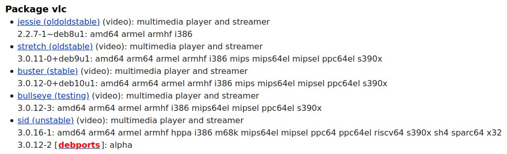

Debian comes with tens of thousands of software packages that you can easily install on your system. But Debian only publishes a new “stable” release every 2-3 years. That creates the impression that Debian packages must always be up to 3 years old. And who wants to work with a three year old piece of software? Are the package maintainers lazy? Should I download my software from its own project website instead?

I feel obliged to briefly discuss this topic because it is a common source of trouble and surprises. And it may make you say…

_“What’s the deal? Shouldn’t we just use Debian packages where we find it comfortable and install any other software in a newer version? Just look at the shiny new Roundcube version. Oh, and rspamd has some new features to filter out spam mails. Why don’t we use that? Even their developers urge me to take their updated packages.”_

So… why are the packages in the “stable” version of Debian so old? Actually that question is pretty funny when you think about it. “stable” means “stay on the same versions if possible”. You might say that it means “old by design”. The idea is that your system will not surprise you with an unexpected update that breaks a service for many users on a monday morning.

## Are stable packages more robust?

No. “stable” relates to the version. I does not necessarily mean more “robust”. The Debian developers do not pick a certain version that they think is especially good or bug-free. The version that made it into a new stable release of Debian was just there when it was about time to create a new release.

“_And what about security issues? Software developer usually fix issues in a newer version. How does Debian deal with that?_“

That is true. Developers hardly ever fix issues in old software. That’s just not fun. Developers like to go forward. While they implement new features they also fix issues on their way. I totally understand that motivation. But that way they force users to accept their changes and new features even if the users just want to fix the security issues. And new versions come with new bugs.

Debian however always tries to _backport_ bug fixes. A Debian package maintainer will try to apply the fix to the stable version in Debian. So you get the benefit of staying on a certain version but at the same time get security updates. That makes it the best possible way to deal with security issues for server administrators. They can rely on their systems without having to fear breaking changes. Only when a new stable version arrives they are forced to consider upgrading.

See also the [Debian FAQ on security](https://www.debian.org/security/faq.en.html#oldversion).

## Give me newer software

Aside from _stable_ packages there are also _unstable_ packages. Let’s take a look at [packages.debian.org/vlc](https://packages.debian.org/vlc) to see which package versions of the famous VLC software are available. This is just a screenshot so you will get different versions:

As you can see there are the different releases like “jessie” (very old), “stretch” (old), “buster” (the stable version when this was written), “bullseye” (the upcoming stable release) and “sid”. By default your system will install the current stable version. If you are on Debian “buster” then it will be 3.0.12-0.

If you wanted newer software you could just replace “buster” by “sid” in your /etc/apt/sources.list and upgrade your system. Done. That way every “apt upgrade” will give you the newest packages that Debian has to offer. And in many cases that is very close to the newest version of the actual (upstream) software. Just be aware that sid/unstable is a moving target. It is impossible to coordinate all updated packages. So it may occur that a new package cannot be properly installed, does not work or even breaks something else on your system. I know people who have sid/unstable on their laptops. But those are the kind of people who know a lot about Debian and do not despair when something breaks.

As a middle ground you might use the “testing” variant. Only packages without any serious bugs will be copied to “testing” so you rule out the worst problems. Still this is not failsafe. There are also _backported_ packages that try to make newer software work on an otherwise “stable” system. But this may give you security issues that are not fixed as quickly as needed. Every choice comes with its own compromises.

So as you see Debian’s packages are not old at all. Just when you do a fresh installation you are usually on a “stable” installation. And that’s for a reason. On a server nobody cares if a piece of software is 2 years old. The focus there is on reliability. And “stable” gives you that.

## What about third-party APT repositories?

“_A lot of software is available directly by its developers through their own APT repositories. Can’t I just use them?_“

Of course. I also pick specific pieces of software from their third-party APT repositories. But those are very rare exceptions and I keep track of what software I get from there. Common problems are:

- unexpected updates that break your system
- broken packages because building proper Debian packages is not trivial
- uninstallable packages the first weeks after a new Debian release because the software was not properly tested with it
- conflicts with other packages in your system because a package did not properly specify that
- missing integration with other software (e.g. Apache configuration, logrotate or systemd)
- no security support like in Debian. To stay safe you are required to run every update. That in turn means adopting any breaking changes.
- files of third-party software should go to /opt but quite often they are scattered in the wrong places
- expired APT keys because the developers didn’t care about expiry dates

However not all is bad. Some third-party packages are very good. Your mileage may vary though.
