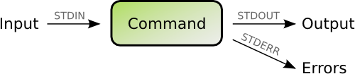

Many system administrators seem to have problems with the concepts of pipes and redirection in a shell. A coworker recently asked me how to deal with log files. How to find the information he was looking for. This article tries to shed some light on it.

# Input / Output of shell commands

Many of the basic Linux/UNIX shell commands work in a similar way. Every command that you start from the shell gets three _channels_ assigned:

- STDIN (channel 0):  
    Where your command draws the input from. If you don’t specify anything special this will be your keyboard input.
- STDOUT (channel 1):  
    Where your command’s output is sent to. If you don’t specify anything special the output is displayed in your shell.
- STDERR (channel 2):  
    If anything wrong happens the command will send error message here. By default the output is also displayed in your shell.

Try it yourself. The most basic command that just passes everything through from STDIN to STDOUT is the ‘cat’ command. Just open a shell and type ‘cat’ and press Enter. Nothing seems to happen. But actually ‘cat’ is waiting for input. Type something like “hello world”. Every time you press ‘Enter’ after a line ‘cat’ will output your input. So you will get an echo of everything you type. To let ‘cat’ know that you are done with the input send it an ‘end-of-file’ (EOF) signal by pressing Ctrl-D on an empty line.

# The pipe(line)

A more interesting application of the STDIN/STDOUT is to chain commands together. The output of the first command becomes the input of the second command. Imagine the following chain:



The contents of the file /var/log/syslog are sent (as input) to the grep command. grep will filter the stream for lines containing the word ‘postfix’ and output that. Now the next grep picks up what was filtered and filter it further for the word ‘removed’. So now we have only lines containing both ‘postfix’ and ‘removed’. And finally these lines are sent to ‘wc -l’ which is a shell command counting the lines of some input. In my case it found 27 of such lines and printed that number to my shell. In shell syntax this reads:
```
cat /var/log/syslog | grep 'postfix' | grep 'removed' | wc -l
```
The ‘|’ character is called _pipe_. A sequence of such commands joined together with pipes are called _pipeline_.

# Useless use of ‘cat’

Actually ‘cat’ is supposed to be used for con**cat**enating files. Like “cat file1 file2”. But some administrators abuse the command to put something into a pipeline. That’s bad style and the reason why Randal L. Schwartz (a seasoned programmer) used to hand out virtual [“Useless use of cat” awards](http://partmaps.org/era/unix/award.html). Shell commands usually can take a filename as the last argument as an input. So this would be right:
```
grep something /var/log/syslog | wc -l
```
While this works but is considered bad style:
```
cat /var/log/syslog | grep something | wc
```
Or if you knew that grep even has a “-c” option to count lines the whole task could be done with just grep:
```
grep -c something /var/log/syslog
```
# Using files as input and output

## Output (STDOUT)

Instead of using the console for input and the screen for output you can use files instead. While
```
date
```
shows you the current date on the console you can use
```
date >currentdatefile
```
to redirect the _output_ of the command (STDOUT) to the file named ‘currentdatefile’.

## Input (STDIN)

This also works as _input_. The command
```
grep something
```
will search for the word ‘something’ in what you type on your keyboard. But if you want to look for ‘something’ in a file called ‘somefile’ you could run
```
grep something <somefile
```
## Input and output

You can also redirect both _input and output_ in the same command. A politically incorrect way to copy a file would be
```
cat <oldfile >newfile
```
Of course you would use `cp` for that purpose in real life.

## Errors (STDERR)

So far this covers STDIN (`<`) and STDOUT (`>`) but you also redirect the STDERR channel by using (`2>`). An example would be
```
grep something <somefile >resultfile 2>errorfile
```
## 2>&1 magic

Many admins stumble when it comes to redirecting one channel to another. Say you want to redirect both STDOUT and STDERR to the same file. Then you cannot do
```
grep something >resultfile 2>resultfile
```
It will only redirect the STDOUT (`>`) there and keep the ‘resultfile’ open so “`2>`” fails to write to it. Instead you need to do
```
grep something >resultfile 2>&1
```
This redirects STDOUT (1) to the ‘resultfile’ and tells STDERR (2) to send the output to what STDOUT is set to (also ‘resultfile’).

What does _not_ work is this order:
```
grep something 2>&1 >resultfile
```
It may look right to us humans but in fact does not redirect STDERR to the ‘resultfile’. The explanation: the shell interprets this line from left to right. So first the “2>&1” is evaluated which means “send STDERR to the same that STDOUT is _currently_ set to”. As STDOUT is usually just printed to the shell it will send STDERR also to the shell. Next the shell finds “>resultfile” which sends STDOUT to the ‘resultfile’ but does _not_ touch the previous destination of STDERR. So STDERR output will still end up in the shell.

# Interesting commands

- grep  
    Filters out lines with certain search words. “grep -v” searches for all lines that do _not_ contain the search word.
- sort  
    Sort the output alphabetically (needs to wait until EOF before doing its work). “sort -n” sorts numerically. “sort -u” filters out duplicate lines.usel
- wc  
    Word count. Counts the bytes, words and lines. “wc -l” just outputs how many lines were counted.
- [awk](http://linux.die.net/man/1/awk)  
    A sophisticated language (similar to Perl) that can be used to do something with every line. `awk ‘{print $3}'` outputs the third column of every line.
- [sed](http://linux.die.net/man/1/sed) (stream editor)  
    A search/replace tool to change something in every line.
- less  
    Useful at the end of a pipe. Allows you to browse through the output one page at a time. (“less” refers to a similar but less capable tool called “more” that allowed you to see the first page and then press ‘Space’ to view ‘more’.)
- head  
    Shows the first ten lines only. “head -50” shows the first 50 lines.
- tail  
    Shows the last ten lines only. “tail -50” shows the last 50 lines. “tail -f” follows a certain file.

