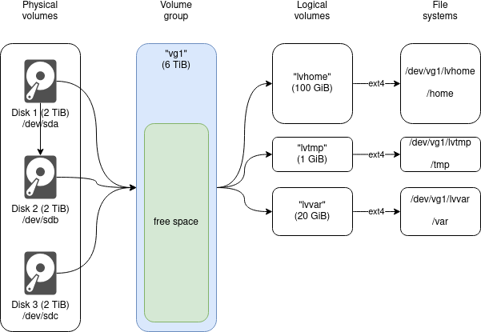

## What is LVM and what does it offer?

LVM is a neat feature that some system administrators still shy away from. But it’s really not that hard to learn. And these are some awesome features you get:

- Create a larger (virtual) disk from smaller disk (similar to RAID-0)
- Extend partitions without any downtime
- Add space by adding disks without any downtime
- Remove unused partitions and get back the space without fragmentation
- Take snapshots of partitions. You can try out things and just roll back. Or you can create consistent database backups without keeping the database down for long.
- Replace disks without losing data.

LVM is just a thin layer of software between the disks on your system and the partitions. On a Debian system you just “apt install lvm2” and you are ready to go.

## The essential concepts

Three terms are commonly used:

- PV (physical volume). A disk. (Or a partition.) Simple as that. An SSD. A hard drive. An SD card.
- VG (volume group). A group of disks. Take three 2 TiB disks and you get a 6 TiB volume group. (Think of it as a RAID-0 or a JBOD – _just a bunch of disks_.)
- LV (logical volume). A fraction of such a group. Just take 200 GiB of the volume group and put a file system on it.

A diagram is worth a thousand words so let’s use an illustration:



### PVs – the physical volumes

On the left you see your three hard disks. Your computer has found them and made them accessible as /dev/sda, /dev/sdb and /dev/sdc. Usually you would create partitions on them (e.g. using _cfdisk_), put a file system on the partitions (_mkfs_) and mount them into your file system (_mount /dev/sda1 /home_).

But this time we create a volume group from it. So first we turn the disks into PVs so that LVM recognizes them:

```
pvcreate /dev/sda
pvcreate /dev/sdb
pvcreate /dev/sdc
```

All this does is write a little meta-data onto each disk.

You can use the “pvs” command command to list the PVs you have just created.

When you take a close look at a PV for example (“pvdisplay” command) you will notice terms like “PE size” or “Free PE” or “Allocated PE”. PE is short for _physical extent_. Such an extent is the smallest data size that LVM handles. By default it’s set to 4 MiB. That means you can grow or shrink a logical volume only by a factor of 4 MiB. Using “lvextend” you can specify the number of extents using “-l …” (lowercase L) instead of the size “-L …” (uppercase L). Further down on this page you will find a tip on replacing a small harddisk by a larger harddisk. That essentially moves the _extents_ from one disk to another.

### VG – the volume group

Next we create a new volume group (VG) from these three disks:

```
vgcreate vg1 /dev/sda /dev/sdb /dev/sdc
```

Now you have VG called “vg1” consisting of the three disks. The “vgs” command shows you an overview:

```
VG     #PV #LV #SN Attr   VSize    VFree   
vg1      3   0   0 wz--n-   <6t      <6t
```

So you see that there is one VG called “vg1” which consists of 3 PVs (disks). And so far no LVs are using it. We will get to that in a moment. Its size is roughly 6 TiB and all of that is free to use.

Using the “vgdisplay” command shows you even more information about it.

### LVs – the logical volumes

The final step is to bite chunks out of the VG. Check out the diagram above. We want a partition for “/home” with a size of 100 GiB. So the command to create your LV is:

```
lvcreate -n lvhome -L 100G vg1
```

Pretty simple. The “-n” parameter sets the name of the new PV. “-L” is the size you want to use. And “vg1” is the name of the VG you want to cut a piece out of.

The “lvs” command will show you an overview of your LVs.

```
LV     VG     Attr       LSize   Pool Origin Data%  Meta%  Move Log Cpy%Sync Convert
lvhome vg1   -wi-ao---- 100,00g
```

There is also an “lvdisplay” command showing more verbose information about the LV.

## Put a file system on the LV

Finally we have something to put a file system on. You have probably used partitions on devices like /dev/sda1 before. But now you are using LVM. And the device for your “lvhome” is “/dev/vg1/lvhome”. Right, it’s “dev” + VG + LV. You could also use “/dev/mapper/vg1-lvhome”.

Put an EXT4 file system onto it:

```
mkfs.ext4 /dev/vg1/lvhome
```

And mount that file system:

```
mount /dev/vg1/lvhome /home
```

## To sum it up

There are PVs (disks), VGs (groups of disk) and LVs (fractions of a VG).

To use LVM first turn disks into PVs (pvcreate), then join them to a VG (vgcreate), then take a fraction of that (lvcreate) and finally create a file system on that (/dev/vgfoo/lvbar).

Every part has a _list_ and a _display_ command. These are:

- PV -> pvs, pvdisplay
- VG -> vgs, vgdisplay
- LV -> lvs, lvdisplay

## Cool everyday tricks with LVM

You may not be impressed yet. LVM just made your life more complicated. Of course there is a reason for it because now begins the fun part. These are some common features:

### Extend a partition without any downtime

Oh, no. Your /home partition is 99% full? With LVM this is easy to solve. If you have free space on your VG (check with “vgs”) you can just extend the disk. No need to unmount anything. No downtime. Let’s give the partition 20 GiB more space:

```
lvextend -L +20G -r /dev/vg1/lvhome
```

The “-r” parameter not only extends the LV but also the file system that lives on top. That allows you to enlarge a partition without taking it offline. This is the neatest feature that LVM delivers in my opinion.

If your _volume group_ is also out of space then you could add another disk (_physical volume)_ and use “pvcreate” and “vgextend” to enlarge it.

### Replace a disk by a larger disk

No problem either. Let’s assume that one of your disks (_physical volumes_) on /dev/sda was 2 TB and you just bought a shiny new 10 TB disk (found on /dev/sdg). Now you want to move the data over to the new disk. As usual you need to turn /dev/sdg into a PV:

```
pvcreate /dev/sdg
```

And now you can just move all blocks (aka _physical extents_ – see below) to the new disk:

```
pvmove /dev/sda /dev/sdg
```

And finally you can remove the PV from your VG:

```
vgreduce vg1 /dev/sda
```

By the way: once a disk is a PV it doesn’t matter whether your system finds it on /dev/sdb, /dev/sdc or any other device. As long as all the necessary PVs are found somewhere the VG will work. Just if your boot sector was written on /dev/sda you may need to re-install it if you change that disk.

### Creating snapshots for backups and profit

A snapshot is like taking a photo with your camera. You get an image of a situation at a certain point in time. Reality will continue to alter the world but your photo will always show that specific moment. You can still take a pen and draw something on the photo so it’s not read-only. (It used to be on LVM 1.x.) I commonly use this technique to get consistent database snapshots of large MySQL/MariaDB databases.

Let’s just say that you have a huge 1 TiB-sized LV called “lvmysql” that is mounted to /var/lib/mysql. Running a backup of those files takes an hour. And while you back up one file after another the SQL database is accessing the various files making arbitrary changes. Your backup would contain unusable garbage. Some files were from minute 5 while others might be from minute 30. Such a backup is unusable.

Now let’s instead use snapshots. Briefly stop the database and take a snapshot:

```
lvcreate -n mysnap -L 20G -s /dev/vg1/lvmysql
```

Note that we use “lvcreate” to take the /dev/vg1/lvmysql LV and create a new /dev/vg1/mysnap LV. Just that the latter is a snapshot.

You can start your database again. With a bit of luck this has just taken a few seconds. And now you have a perfectly consistent copy of the MySQL data directory. You can mount this snapshot anywhere in your file system:

```
mount /dev/vg1/mysnap /mnt/mysnap
```

Now you can take your time and just make a backup of /mnt/mysnap. It won’t change.

However the magic comes at a price. Have you noticed the “-L 20 G” parameter? That does not mean that the snapshot has a size of 20 GiB. After all we started with a 1 TiB LV. So why did we specify a size at all?

The answer lies in the way that snapshots work. Once you started MySQL again the data directory was changed. LVM needs to provide you with your snapshot but at the same time allow MySQL to continue doing its work. That works by a mechanism called _copy-on-write_. If the original LV would not change then it would be identical to the snapshot. If however the files on the LV are changed then LVM needs to keep a copy of the snapshotted state. The more changes you do the more space for those copies you will need. And that’s what is meant by “-L 20 G”. It gives your snapshot a 20 GiB storage area to track the changes.

The size depends on how much change you expect while you want to use the snapshot. If the backup takes an hour and the database typically changes 100 GiB during that period then you should give the snapshot at least that space. The “lvs” command shows you much much of that space has been used already. So you should keep the snapshot no longer than needed for a backup. Should you hit the 100% mark then your snapshot becomes unusable and all you can do it remove it. That won’t affect the original LV fortunately. So you won’t break your database.

Another use case of snapshots would be to try out things on the snapshot. And if you like what you did then merge the changes to the original LV. That can be done using “lvconvert –merge /dev/vg1/mysnap”. But I suggest you consult the man page of “lvconvert” before you do that.

### Booting from an LV

Using LV for all partitions used to be a problem in the past. Debian created an ext2 partition for /boot to make sure the system boots. This has become obsolete for quite a while. You can use LVs everywhere and Debian will happily boot the system.

### RAID

By default LVM uses RAID-0. That is the [RAID](https://de.wikipedia.org/wiki/RAID) level that makes you lose everything if a single disk fails. LVM support RAID levels 1 and 5 though. Besides the LVM man pages I mainly found [this web page](https://blog.programster.org/create-raid-with-lvm) describing it.
