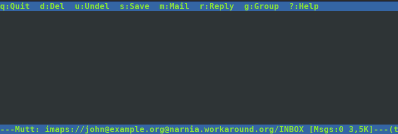
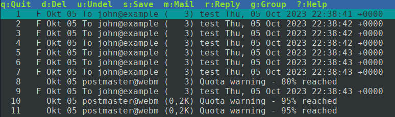

You have already completed the configuration of Dovecot. So fetching emails via IMAP should already work. Let’s give it a try using a simple-looking but powerful IMAP client: _mutt_.
```
mutt -f imaps://john@example.org@**webmail.example.org**
```
The connection URL may look a little confusing because of the two “@” characters. Usually _mutt_ expects the format `imaps://user@server`. And as we use the email address as the “user” part you get this look.

You should get prompted for the password which we set to “summersun”. If you get any certificate warnings then check if you used the correct server name to connect to and if you completed the certificate/LetsEncrypt part earlier in this guide.

After logging in you will see an empty inbox:



Or if you have played around with quotas in the previous section you will see a couple of emails plus the quota warnings:



Very good – IMAP connections and authentication works. That’s all we wanted to test. Exit _mutt_ by pressing “q”.

Congratulations. At this point your server can already receive emails.
