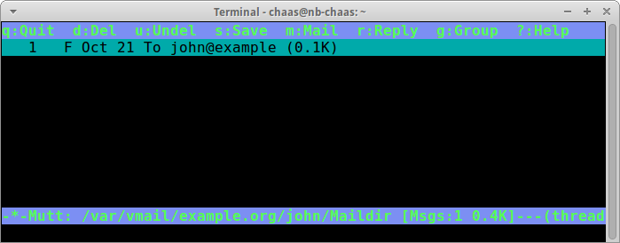
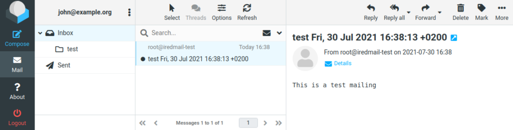

So far you have spent considerable time with theory and configuration. Are you worried whether all you did actually leads to a working mail server? Before we do the final steps let’s take a break and verify that everything you did so far works as expected.

At this point the /var/vmail directory should be empty or maybe contain an “example.org” directory if you played with the john@example.org account previously. You can get a list of all files and directories within by running:
```
find /var/vmail
```
Although there are not actually any emails on the server yet, you may still get something along the lines of:
```
/var/vmail
/var/vmail/example.org
/var/vmail/example.org/john
/var/vmail/example.org/john/.dovecot.sieve
/var/vmail/example.org/john/sieve
/var/vmail/example.org/john/sieve/roundcube.sieve
/var/vmail/example.org/john/sieve/tmp
/var/vmail/example.org/john/Maildir
/var/vmail/example.org/john/Maildir/subscriptions
/var/vmail/example.org/john/Maildir/maildirfolder
/var/vmail/example.org/john/Maildir/new
/var/vmail/example.org/john/Maildir/cur
/var/vmail/example.org/john/Maildir/.INBOX.test
/var/vmail/example.org/john/Maildir/.INBOX.test/maildirfolder
/var/vmail/example.org/john/Maildir/.INBOX.test/new
/var/vmail/example.org/john/Maildir/.INBOX.test/dovecot.index.log
/var/vmail/example.org/john/Maildir/.INBOX.test/cur
/var/vmail/example.org/john/Maildir/.INBOX.test/dovecot-uidlist
/var/vmail/example.org/john/Maildir/.INBOX.test/tmp
/var/vmail/example.org/john/Maildir/dovecot-uidvalidity.5ddc842b
/var/vmail/example.org/john/Maildir/tmp
```
Basically the schema you see here is /var/vmail/DOMAIN/USER/Maildir/…

Eeach IMAP mail folder has three subdirectories:

- `new` – every file here is an email that was stored in this mail folder but not yet read
- `cur` – the same but for email that has been read already
- `tmp` – for temporary files from the mail server

Nested folders (folders within folders) will be separated by a dot like this:

- …/Maildir/new/… – the main inbox
- …/Maildir/.INBOX.reddit/new/… – the “reddit” mail folder below the inbox
- …/Maildir/.INBOX.servers.inga/new/… – the “servers”/”inga” mail folder below the inbox

## Check Postfix

To check for obvious configuration error in Postfix please run:
```
postfix check
```
Did you get the error…  
“_error: open database /etc/aliases.db: No such file or directory_“? Don’t worry. Just run the “newaliases” command to create a new machine-readable file from what aliases were defined in the `/etc/aliases`.

Very likely you will get this error: “_postfix/postfix-script: warning: symlink leaves directory: /etc/postfix/./makedefs.out_“. That is a [harmless bug of the Debian package](https://bugs.debian.org/926331) that can safely be ignored.

## Send a test email

It is time to send a new email into the system. Open a new terminal window and run
```
tail -f /var/log/mail.log
```
to see what the mail server is doing. Now let’s send an email to John. My favorite tool for mail tests is _swaks_ that you installed earlier. In a second terminal run:
```
swaks --to john@example.org --server localhost
```
If all works as expected, your mail.log will show a lot of technical information about the email delivery. Let me explain what happens at each stage.

- `postfix/smtpd[29225]: connect from localhost.localdomain[127.0.0.1]`  
    Postfix receives an incoming SMTP connection.
- `postfix/smtpd[29225]: 8BA46A0A3A: client=localhost.localdomain[127.0.0.1]`  
    Postfix assigns a unique identifier (8BA46A0A3A) to this connection so that you see which log lines belong together. This is especially important with busy mail servers where multiple mails are handled in parallel.
- `postfix/cleanup[29233]: 8BA46A0A3A: *message-id=20191126153053.029243@webmail.example.org`  
    _swaks_ created a unique [message id](https://en.wikipedia.org/wiki/Message-ID) to the email which helps you identify specific mails in the log file.
- `postfix/qmgr[13667]: 8BA46A0A3A: from=root@webmail.example.org, size=485, nrcpt=1 (queue active)`  
    The sender was root@webmail.example.org. This is logged after _swaks_ sent the “MAIL FROM” line during the SMTP dialog.
- `postfix/smtpd[29225]: disconnect from localhost.localdomain[127.0.0.1] ehlo=1 mail=1 rcpt=1 data=1 quit=1 commands=5`  
    The SMTP communication ends. Postfix has now received and queued the email.
- `dovecot: lmtp(29237): Connect from local`  
    Postfix connects to Dovecot to hand over the email via the LMTP interface.
- `dovecot: lmtp(john@example.org)<29237><2PJTIh033V01cgAARGEcaw>: sieve: msgid=20191126153053.029243@webmail.example.org: stored mail into mailbox 'INBOX.test'`  
    Dovecot received the email and even evaluated John’s sieve rule which made the email get stored to the ‘test’ folder of his mailbox.
- `dovecot: lmtp(29237): Disconnect from local: Client has quit the connection (state=READY)`  
    The LMTP connection between Postfix and Dovecot is closed.
- `postfix/lmtp[29236]: 8BA46A0A3A: to=john@example.org, relay=webmail.example.org[private/dovecot-lmtp], delay=0.01, delays=0/0/0/0.01, dsn=2.0.0, status=sent (250 2.0.0 john@example.org 2PJTIh033V01cgAARGEcaw Saved)`  
    This is the one of the most interesting lines in your mail log. It tells you what happened with a certain email. In this case it says that it was handed over to _dovecot-lmtp_ and that the delivery was successful (_status=sent_). The status codes like 2.0.0 are defined in [RFC 3463](https://tools.ietf.org/html/rfc3463) and work similar to status codes in HTTP. Codes beginning with ‘2’ are good. Those with ‘4’ are temporary errors. And ‘5’ stands for a permanent failure.

Your output may look slightly differently. Just focus on the parts that are printed in **bold letters**. If everything worked as expected Postfix has accepted the email and forwarded it to Dovecot which in turn wrote the email in John’s maildir. If you get any errors in the log file then try to understand the error message and find the cause of the problem before you proceed.

Look again:

find /var/vmail

Dovecot has now created a directory structure for John and created a new file:
```
/var/vmail/
[…]
/var/vmail/example.org/john/Maildir/new/1515485447.M404984P2636.mail,S=510,W=522
[…]
```
The file will have a different name on your system – that’s okay. It is the only file in the “new” folder.

## Accessing the email as a file on disk

The file just contains the email:

```
Return-Path: <root@mail.example.org>
Delivered-To: john@example.org
Received: from mail.example.org
 by mail.example.org (Dovecot) with LMTP id iHHHEwd5VFpMCgAA3BOsLQ
 for <john@example.org>; Tue, 09 Jan 2018 09:10:47 +0100
Received: by mail.example.org (Postfix, from userid 0)
 id 30B4B41A98; Tue, 9 Jan 2018 09:10:47 +0100 (CET)
Message-Id: <20180109081047.30B4B41A98@mail.example.org>
Date: Tue, 9 Jan 2018 09:10:47 +0100 (CET)
From: root@mail.example.org (root)

Di 9. Jan 09:10:47 CET 2018
```
The advantage of this is that backups are easy and you can even restore single files if a user has accidentally removed an email.

If anything went wrong then carefully check the last lines of your /var/log/mail.log. It will very likely point you to the problem. Or read the troubleshooting section. Or just add a comment to this page and ask other readers for help.

You can also use a slightly more comfortable tool to access Maildirs that will come handy for you as a mail server administrator: “mutt”.
```
mutt -f /var/vmail/example.org/john/Maildir
```
(You may get asked to create /root/Mail – this is standard procedure. Just press Enter.)

What you see now are the contents of John’s mailbox:



Using _mutt_ is a nice way to check mailboxes while you are logged in to the mail server.

To reiterate what happens when you receive an email:

1. Postfix receives the email (using the “swaks” command in this example – but usually through the network using the SMTP protocol from other servers)
2. Postfix asks Dovecot if the user is over quota
3. Postfix talks to Dovecot via LMTP and hands over the email
4. Dovecot runs through the user’s Sieve rules
5. Dovecot writes the email file to disk


## Accessing the email via IMAP (Roundcube)

Now that the email has been delivered you can talk to Dovecot using the IMAP protocol to retrieve your email again. Are you still logged in via the Roundcube webmail interface? Then just reload and you will see the email:



## Access the email through IMAP (desktop client)

Your users are not likely to use “mutt” to read their email – unless they are immortal console nerds. So of course you can use a graphical mail client to access John’s emails. If you use Thunderbird, Evolution, Apple Mail or some other IMAP client then feel free to configure a new IMAP account and connect to the server. Remember that the user name and email address are both `john@example.org` and the password is “summersun”.

## POP3 versus IMAP

Aside from talking IMAP Dovecot also knows how to speak POP3. But let’s face it – POP3 is dead. I do not even offer it to my users any more. But as your users may ask let’s quickly review the differences of the two protocols:

- _POP3_ (Post Office Protocol) is a simple protocol that lets you fetch email from a single mailbox. You can’t create multiple folders on the server to organize your mails. It saves space on the mail server because the email usually gets moved to the user’s hard disk on their computer. This variant is pretty antiquated.
- _IMAP_ (Internet Messaging Application Protocol) is predominantly focused upon leaving your mail on the server. The inbox is where your incoming emails are stored but users can also maintain folders and move emails to them. But users can move emails to different sub-folders. IMAP is useful when you want to access your email from different locations without losing mail because you fetched it from another location. The drawback is that lazy users leave their mail on the server thus filling up your server’s hard disk – for which quotas are a good solution.
