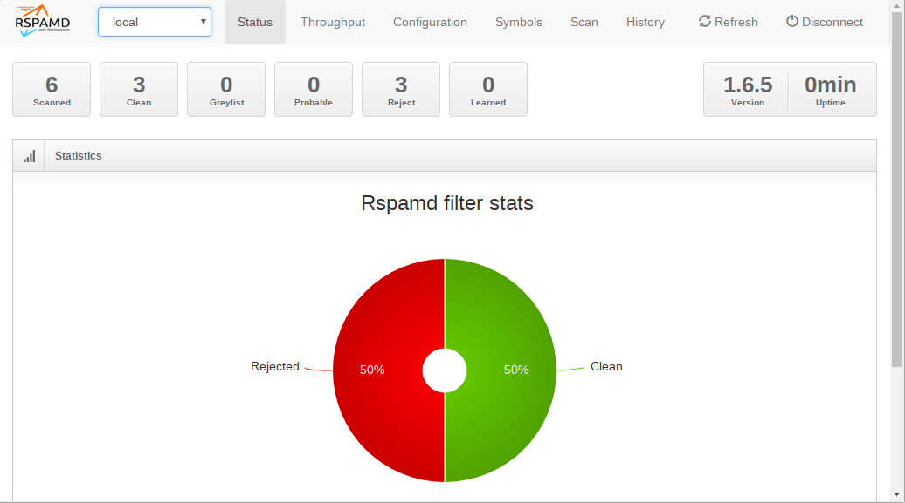

import { Aside } from "@astrojs/starlight/components";

<Aside type="tip" title="Optional feature">
This feature is completely optional. If you are eager to get finished then skip this page and maybe come back later.
</Aside>

You have come a long way in this guide and your mail server is already fully functional. Now it’s time to deal with the dark side: spam. And there will be lots of it. So we need to detect spam emails and filter them out. I found that [rspamd](https://rspamd.com/) is a well-performing choice for that purpose both in speed and detection. rspamd keeps a permanent process running on your mail server that listens to connections from Postfix using the [milter](http://www.postfix.org/MILTER_README.html) (=**m**ail f**ilter**) protocol. Every time an email enters your system, Postfix will send it to rspamd to have its content checked. rspamd runs a lot of checks on the email and computes a total score. The higher the score – the more likely the email should be considered unsolicited.

## How free is rspamd?

rspamd is quite effective against spam thanks to its many kinds of checks that incoming emails run through. Several of these checks rely on services provided by the rspamd project. There are web sites like email.rspamd.com, uribl.rspamd.com and maps.rspamd.com that provide information used by the default rspamd installation. That data is not freely available and there are no public mirrors.

You are only allowed to use their data under certain conditions described in rspamd’s [usage policy](https://docs.rspamd.com/other/usage_policy/). Spoiler: heavy or commercial usage will get you blocked. So it may be wise to disable all features that include this email and URL blacklists and the “fuzzy” feature.

rspamd is being packaged and shipped by the Debian project. However the rspamd principal developer builds and endorses his own packages and has a history of getting angry and offensive against anyone using the packages shipped by Debian. I find that attitude a bit suspicious and rather stay with the Debian packages that have been built by a process that I trust.

## Make Postfix use rspamd

Let’s tell Postfix to send all incoming email through rspamd. Run these commands on the shell:

```
postconf smtpd_milters=inet:127.0.0.1:11332
postconf non_smtpd_milters=inet:127.0.0.1:11332
postconf milter_mail_macros="i {mail_addr} {client_addr} {client_name} {auth_authen}"
```

Postfix will connect to rspamd that is listening to TCP port 11332 on localhost (127.0.0.1) and send the email through that connection. The _smtpd\_milters_ setting defines that connection for emails that came into the system from the internet via the SMTP protocol. The _non\_smtpd\_milters_ setting is optional – it makes Postfix have all emails checked that originate from the system itself. Finally the _milter\_mail\_macros_ setting defines several variables that rspamd expects for better spam detection. rspamd then runs its checks and tells Postfix whether the email should pass or get rejected.

## Testing spam detection

For testing we can use a sample spam email that comes with SpamAssassin. It is called GTUBE (Generic Test for Unsolicited Bulk Email). It contains a certain artificial pattern that is recognized as spam by SpamAssassin. Do you know EICAR.COM to test virus scanners? This is the same thing for spam.

I suggest that you download the file on the server:

```
wget http://spamassassin.apache.org/gtube/gtube.txt
```

…and send that email to our test user John…

```
sendmail john@example.org < gtube.txt
```

Check your /var/log/mail.log. You will find something like this:

```
Jan 13 09:21:01 mail postfix/cleanup[19945]: 95B7A42212: milter-reject: END-OF-MESSAGE from localhost[127.0.0.1]: 5.7.1 Gtube pattern; from=<root@mail.example.org> to=<john@example.org>

Jan 13 09:21:01 jen postfix/cleanup[19945]: 95B7A42212: to=<john@example.org>, relay=none, delay=0.18, delays=0.18/0/0/0, dsn=5.7.1, status=bounced (Gtube pattern)
```

“milter-reject” tells that the milter (rspamd) recommended to Postfix to reject the email. It gave the reason “5.7.1 Gtube pattern”. In mail communication you often find these three digit codes. They are defined in [RFC 3463](https://tools.ietf.org/html/rfc3463). The first digit is most important:

- 2 = Success
- 4 = Transient failure (temporary problem – come back later)
- 5 = Permanent failure (do not try again in this way)

So 5.7.1 tells us that the result code is a permanent failure in delivery. If you looked up the RFC you would find that the 7 stands for an issue regarding the security policy. So it’s not a technical failure but instead a security-relevant component on the system has rejected the email. That’s what rspamd did. It even told us the reason: “Gtube pattern”. So you see that rspamd knows about the Gtube spam test pattern and reacts as expected.

Accordingly you won’t see this email in John’s inbox. This is a great advantage of using milters. Imagine Postfix receiving a spam email and confirm its reception. What should it do when it finds out that it’s unwanted email? According to the SMTP protocol it must not throw away any emails. Would you create a bounce message telling the sender that you did not accept the email? That would be a bad idea because the sender address in spam emails is very likely forged. You would send the bounce to an innocent person thus creating so called _backscatter_ and make it even worse. So the better approach is to check the email while the sending server is still connected to your Postfix. This allows Postfix to reject the email with a 5.x.x error code and let the other side figure out what to do.

## Score metrics

rspamd will however not reject all spam email. It computes a score that tells how likely a certain email is spam. You can tell it which scores you would accept, flag as spam or make the incoming email get rejected. Rspamd has a large ruleset that checks incoming emails in various ways and adds to the score. Take a look at the `/etc/rspamd/actions.conf` file:

```
actions {
  reject = 15;
  add_header = 6;
  greylist = 4;
}
```

These are the default actions. If rspamd computes a score of at least 15 then the email will get rejected at the doorstep just like the _Gtube pattern_ in the previous test. Any other score above 6 will add a line “X-Spam: Yes” so that your mail software can detect them and maybe file the email to a different folder. And any other score above 4 will trigger _greylisting_ which is a mechanism that temporarily rejects the email with a 4.x.x code and waits if the sending server will try again. After a waiting time of a few minutes greylisting will accept the email. The idea is to reject email from systems that do not have a sending queue. Malware like on infected Wind\*ws computers used to try sending an email just once which triggered greylisting and successfully rejected the spammer. But even malware programmers have learned and may try again after a few minutes thus circumventing greylisting. Your mileage may vary. The problem with greylisting is that the recipient has to wait a couple of minutes for the email to be delivered which is often bothering the users.

If you like to change these defaults then create a new file in `/etc/rspamd/local.d/actions.conf` containing your desired limits:

```
reject = 150;
add_header = 6;
greylist = 4;
```

This would virtually never reject an email. The other two values are pretty sane defaults. I personally use this setting all the time so that users can find spam in their _Junk_ folder but don’t have to ask me if the mail server rejected it.

Please take a moment to understand how to change rspamd defaults. You can either create files in `/etc/rspamd/override.d/…` which will replace entire sections; or create files in `/etc/rspamd/local.d/…` which will change only parts of the configuration. There is a [helpful page in the rspamd documentation](https://rspamd.com/doc/developers/writing_rules.html) that contains examples. Whatever you do – never change the /etc/rspamd/\* files directly because a software update will try to replace them.

Restart rspamd after any configuration changes:

```
systemctl restart rspamd
```

To check if rspamd has picked up your configuration use this command to see the current configuration:

```
rspamadm configdump
```

You may test your configuration using

```
rspamadm configtest
```

Alternatively you may check if all required rspamd processes are running…


```
pgrep -a rspam

141693 rspamd: main process
141694 rspamd: rspamd\_proxy process (localhost:11332)
141695 rspamd: controller process (localhost:11334)
104965 rspamd: normal process (localhost:11333)
104966 rspamd: normal process (localhost:11333)
```

## Adding headers

As you may know an email consists of the headers and the body. Your users will usually only see common header information like the _subject_, the _sender_, the _recipient_ and the _date and time_ the email was sent. But there is way more information like the route the email traveled or extended headers added by the various mail server on the way to the destination. Such extended headers begin with an “X-“. rspamd can add such headers to help you filter out spam. For that purpose create a new configuration override file at `/etc/rspamd/override.d/milter_headers.conf` with this content:

```
extended_spam_headers = true;
```

Again restart rspamd:

```
systemctl restart rspamd
```

As [documented](https://rspamd.com/doc/modules/milter_headers.html) it will add these headers:

```
X-Rspamd-Server: mail
Authentication-Results: dmarc=fail reason="No valid SPF, No valid DKIM" …
X-Rspamd-Queue-Id: C22E55A005B3
X-Spamd-Result: default: False [11.55 / 15.00]
 R_PARTS_DIFFER(0.27)[63.4%]
 FROM_NO_DN(0.00)[]
 RCVD_COUNT_ZERO(0.00)[0]
 R_DKIM_NA(0.00)[]
 FUZZY_DENIED(12.00)[1:19305c7fdd:1.00:bin,1:35699594fd:0.91:txt]
 RBL_SENDERSCORE(2.00)[55.181.23.94.bl.score.senderscore.com]
 ARC_NA(0.00)[]
 RCPT_COUNT_ONE(0.00)[1]
 RCVD_TLS_ALL(0.00)[]
 FROM_EQ_ENVFROM(0.00)[]
 R_SPF_SOFTFAIL(0.00)[~all]
 BAYES_HAM(-2.71)[98.75%]
 TO_MATCH_ENVRCPT_ALL(0.00)[]
 MIME_GOOD(-0.10)[multipart/related,multipart/alternative,text/plain]
 MID_RHS_MATCH_FROM(0.00)[]
 ASN(0.00)[asn:16276, ipnet:94.23.0.0/16, country:FR]
 TO_DN_NONE(0.00)[]
 DMARC_POLICY_SOFTFAIL(0.10)[Chronopost.fr : No valid SPF, No valid DKIM,none]
 SUBJECT_ENDS_EXCLAIM(0.00)[]
X-Spam: Yes
```

<Aside type="tip" title="No headers?">
Please note that rspamd only adds headers if an email is received from outside your server. So if you use _swaks_ locally then you will not get anything.
</Aside>

Each of the uppercase symbols like _FROM\_HAS\_DN_ means that a certain detection rule of rspamd was triggered. It does not necessarily mean something bad about the email. For example _R\_SPF\_ALLOW_ has a negative score that lowers the total score because it is something good about the email. There are a several symbols with a 0.00 score. These do not change the score but show you what rspamd has found. But if you consider certain criteria good or bad then you can define your own scores for them.

The last line here is especially interesting because next on our list is…

## Sending spam to the Junk folder

Your users will not realize that their spam emails have an added “X-Spam: Yes” header. It is not actively shown in their mail client. Nor does it move the email out of the inbox into their spam folder. Such emails just appear like normal in their inbox. So let’s aid them by moving spam to a separate _Junk_ folder beneath their inbox automatically. Dovecot has support for [Sieve](https://en.wikipedia.org/wiki/Sieve_\(mail_filtering_language\)) filters which are scripts that run automatically whenever an email comes in.

John could create a new Sieve filter (e.g. using the Roundcube webmail interface) for himself that would save any emails to his “Junk” folder if the header line “X-Spam: Yes” was found. This rule would be useful for all your users though so let’s find a more general solution.

Dovecot supports _global_ Sieve filters that apply to all users. Edit the file `/etc/dovecot/conf.d/90-sieve.conf`. Look for the “sieve\_after” lines. They are commented out. Add a new line there:

```
sieve_after = /etc/dovecot/sieve-after
```

And restart Dovecot:

```
systemctl restart dovecot
```

The “_sieve after_” filters are executed after the users’ filters. John can define his own filter rules. And after that Dovecot will run any filter rules it finds in files in `/etc/dovecot/sieve-after`. That is just an arbitrary directory that you create:

```
mkdir /etc/dovecot/sieve-after
```

And add a new file `/etc/dovecot/sieve-after/spam-to-folder.sieve` reading:

```
require ["fileinto"];

if header :contains "X-Spam" "Yes" {
 fileinto "Junk";
 stop;
}
```

The “require” lines include functionality to move emails into certain folders (fileinto) and to create folders if they don’t exist yet (mailbox). Then if rspamd marked an email as spam it gets moved into the INBOX.Junk folder which just appears as “Junk” to the user underneath their inbox.

Dovecot cannot deal with such human-readable files though. So we need to compile it:

```
sievec /etc/dovecot/sieve-after/spam-to-folder.sieve
```

That generated a machine-readable file /etc/dovecot/sieve-after/spam-to-folder.svbin.

Now all your users will automatically get spam emails moved to their Junk folder. Nice – isn’t it?

## About Redis

Many features in Rspamd use [Redis](https://redis.io/) to persist their data. Let me give you a quick explanation what Redis is.

Redis is a kind of database system. It is way more limited than a traditional SQL database because it just stores keys and values. There aren’t several fields/columns like in SQL. But it is lightning fast the way it works. On my aged server it handles around 50,000 requests per second. It gets it speed from its simplicity and from keeping the data in RAM. So it doesn’t access the disk to fetch information. (But it copies its data to disk frequently to prevent data loss.) People use Redis as a cache or for very fast lookups of simple data structures. And so [does rspamd](https://rspamd.com/doc/configuration/redis.html).

You installed the “redis-server” package earlier. And that’s all you needed to do. It started automatically and listens ton incoming connections on TCP port 6379 on localhost. In Rspamd the Redis backend is enabled by default. You just have to tell it the IP address of your Redis server. Add a file `/etc/rspamd/override.d/redis.conf` and insert:

```
servers = "127.0.0.1";
```

Restart rspamd and you are done.

```
systemctl restart rspamd
```

Feel free to use Redis for [other lookups](https://rspamd.com/doc/configuration/redis.html), too.


## Training the spam detection

One of rspamd’s features is analyzing word patterns using probability theory. That functionality is contained in its “[statistical module](https://rspamd.com/doc/configuration/statistic.html)“. (Yes, the name is pretty misleading.) Essentially you show rspamd lots of ham (good) and spam (bad) emails and its detection gets better over time.

<Aside type="tip" title="Redis replaces SQLite">
Rspamd recommends (and defaults to) using Redis to store spam training data. That’s what we will use now.
</Aside>

### (a) Auto-learning

You can start with an empty training database. This is not as bad as it sounds. rspamd has way more functionality to determine if an email is ham or spam. Autolearning takes email that are likely ham or spam and uses them to train the spam filter. The [rspamd documentation](https://rspamd.com/doc/configuration/statistic.html) has further examples how to fine-tune auto learning. After a few hundred emails the training will contribute towards a better detection rate.

If you want to use _autolearning_ just create a new file `/etc/rspamd/override.d/classifier-bayes.conf` and make it contain:

```
autolearn = [-5, 10];
```

That will train emails with a spam score of less than -5 as ham (good). And emails with a spam score of more than 10 as spam (unwanted). Feel free to chose other values.

### (b) Migrating training data from previous mail server

Have you used the old SQLite-based training file on the old server? Look for files like /var/lib/rspamd/\*.sqlite on the old server. In that case please follow these [simple instructions from the rspamd documentation](https://rspamd.com/doc/faq.html#which-backend-should-i-use-for-statistics) to convert them to data in Redis.

If instead you have used Redis already then you just need to copy over the Redis database from the old server. Stop Redis on the new server. Copy over the /var/lib/redis/dump.rdb from the old server to the new server. Start Redis again. And restart rspamd. So on the new server run:

```
systemctl stop redis
scp root@old-server:/var/lib/redis/dump.rdb /var/lib/redis
systemctl start redis
systemctl restart rspamd
```

To check if that worked you can ask Rspamd using “rspamc stat” and look for…

```
Statfile: BAYES_SPAM type: redis; length: 0; free blocks: 0;
    total blocks: 0; free: 0.00%; learned: 21164; users: 214; languages: 0
Statfile: BAYES_HAM type: redis; length: 0; free blocks: 0;
    total blocks: 0; free: 0.00%; learned: 1411; users: 62; languages: 0
```

### (c) Training from your existing ham and spam emails

Have you been running a mail server with mailboxes in a _Malidir_ structure before but without rspamd? Then you probably have a good amount of ham and spam emails. Let’s use those to train rspamd. It is important to train both ham and spam emails. The _rspamc_ command will allow you to feed entire directories/folders of emails to the learning process. An example to train spam:

```
rspamc learn\_spam /var/vmail/example.org/john/Maildir/.Junk/cur
```

And this would be an example to train ham from John’s inbox:

```
rspamc learn\_ham /var/vmail/example.org/john/Maildir/cur
```

Of course the quality of spam detection will depend on how good the source data is. If users put emails in their Junk folder which are not typical spam they will soil the detection.

Check the number of emails you learned by running…

```
rspamc stat
```

Bayes spam checking will not work before it learned at least 200 spam and ham emails. Teaching rspamd fewer emails or just spam emails will not work. This is defined by the _min\_learns_ variable defined in /etc/rspamd/statistic.conf.

In the output you will find lines beginning with “Statfile” like these…

```
Statfile: BAYES_SPAM type: redis; length: 0; free blocks: 0;
    total blocks: 0; free: 0.00%; learned: 21164;
    users: 214; languages: 0

Statfile: BAYES_HAM type: redis; length: 0; free blocks: 0; 
    total blocks: 0; free: 0.00%; learned: 1411;
    users: 62; languages: 0
```

This is what you usually start with. The more emails you feed into the training process the better the detection rate will be. Some emails however may not be long enough or too similar to previously trained emails. So don’t worry if you are training 1000 emails but just get a count of 500 emails here.

## Per-user spam training

rspamd allows you to train the spam detection per user. It would not keep a global training database that applies to all users. Instead each user gets their own training.

Advantage: users work differently. Some have subscribed to a sales newsletter and now believe that marking it as spam gets them unsubscribed. Yes, that’s stupid but can thoroughly confuse the spam detection. Also you might be very interested in viagr\* product information while others do not.

Disadvantage: training still requires many ham and spam mails before it has any effect. So unless a user gets 200 samples of good and evil emails the spam detection cannot work. Many users will not get that many emails so due to the lack of spam training the detection will not be improved.

If you decide you want to use per-user spam training then add/edit the file `/etc/rspamd/local.d/classifier-bayes.conf` and insert:

```
users_enabled = true;
```

## Autoexpunge

Andi Olsen pointed out that Dovecot has introduced a [feature](https://wiki.dovecot.org/MailboxSettings) to automatically delete emails in a folder that reach a certain age. This is especially useful for the “Trash” and “Junk” folders. To enable this feature just edit the `/etc/dovecot/conf.d/15-mailboxes.conf` file and add the _autoexpunge_ parameter where desired. Example:

```
mailbox Junk {
  special_use = \Junk
  auto = subscribe
  autoexpunge = 30d
}
mailbox Trash {
  special_use = \Trash
  auto = subscribe
  autoexpunge = 30d
}
```

The “auto = subscribe” makes sure that the “Junk” and “Trash” folders are automatically created for every user. Otherwise spam emails cannot be moved to the “Junk” folder later.

## Learning from user actions

Now we are getting to something really cool. Let’s tell Dovecot that moving emails into the Junk folder teaches rspamd instantly that the email is spam. And train an email as ham if it is moved out of the Junk folder. We will add triggers (actually “_sieve scripts_“) to the action of moving emails via IMAP.

The currently recommended way is to use the “[IMAPSieve](https://doc.dovecot.org/2.3/settings/pigeonhole-ext/imapsieve/)” plugin instead. There is nothing to install – it comes with the Dovecot packages. We just need to configure it.

First order of business is enabling the IMAPSieve plugin for the IMAP protocol/service in Dovecot. Edit the `/etc/dovecot/conf.d/20-imap.conf` file and look for the line reading “mail\_plugins”. Turn it into:

```
mail_plugins = $mail_plugins quota imap_sieve
```

We also need to edit Dovecot’s Sieve configuration to enable two plugins that are required for our task. Sieve is a scripting language that automates things in conjunction with emails and folders. Edit the file `/etc/dovecot/conf.d/90-sieve.conf` and put these lines into the `plugin {…}` section:

```
# From elsewhere to Junk folder
imapsieve_mailbox1_name = Junk
imapsieve_mailbox1_causes = COPY
imapsieve_mailbox1_before = file:/etc/dovecot/sieve/learn-spam.sieve

# From Junk folder to elsewhere
imapsieve_mailbox2_name = *
imapsieve_mailbox2_from = Junk
imapsieve_mailbox2_causes = COPY
imapsieve_mailbox2_before = file:/etc/dovecot/sieve/learn-ham.sieve

sieve_pipe_bin_dir = /etc/dovecot/sieve
sieve_global_extensions = +vnd.dovecot.pipe
sieve_plugins = sieve_imapsieve sieve_extprograms
```

The first rule tells Dovecot to run the Sieve rules as defined in the `/etc/dovecot/sieve/learn-spam.sieve` file whenever an email is moved into a user’s “Junk” folder. We will create that Sieve script in a minute.

The second rule sets the other way. Whenever an email is moved from the “Junk” folder to any (\*) folder then the `/etc/dovecot/sieve/learn-ham.sieve` Sieve script is called.

The “sieve\_pipe\_bin\_dir” setting defines where executable scripts are allowed to reside. We will put our simple learning scripts there. And finally the “sieve\_global\_extensions” setting enables the pipe plugin that allows sending email to external commands.

Next up let’s create the Sieve scripts that we told Dovecot about. Create a new directory /etc/dovecot/sieve to put our new files in:

```
mkdir /etc/dovecot/sieve
```

Then create the file `/etc/dovecot/sieve/learn-spam.sieve` and let it contain:

```
require ["vnd.dovecot.pipe", "copy", "imapsieve"];
pipe :copy "rspamd-learn-spam.sh";
```

Let’s do the same for `/etc/dovecot/sieve/learn-ham.sieve`

```
require ["vnd.dovecot.pipe", "copy", "imapsieve", "variables"];
if string "${mailbox}" "Trash" {
  stop;
}
pipe :copy "rspamd-learn-ham.sh";
```

The above Sieve script avoids training an email as _ham_ if the user moves it to the _Trash_ folder. After all if you clear your _Junk_ folder you do not want to train your spam as regular emails.

Restart Dovecot:

```
systemctl restart dovecot
```

These two scripts need to be compiled – that is turning them into machine-readable code:

```
sievec /etc/dovecot/sieve/learn-spam.sieve
sievec /etc/dovecot/sieve/learn-ham.sieve
```

This creates two new files “learn-ham.svbin” and “learn-spam.svbin” that look like gibberish inside but are now in a format that Dovecot’s Sieve plugin can understand.

Let’s fix the permissions of these files, too, while we are at it:

```
chmod u=rw,go= /etc/dovecot/sieve/learn-{spam,ham}.{sieve,svbin}
chown vmail:vmail /etc/dovecot/sieve/learn-{spam,ham}.{sieve,svbin}
```

And the last step is to create the simple shell scripts that do the actual spam/ham training. The first file is `/etc/dovecot/sieve/rspamd-learn-spam.sh` which contains:

```
#!/bin/sh
exec /usr/bin/rspamc learn_spam
```

That looks simple, doesn’t it? Nothing more is actually needed. The spam email is piped to this script and rspamd learns it as a spam email and adjusts its spam detection database accordingly.

The second script teaches ham and is called `/etc/dovecot/sieve/rspamd-learn-ham.sh`. Make it contain:

```
#!/bin/sh
exec /usr/bin/rspamc learn_ham
```

These two shell scripts must be made executable:

```
chmod u=rwx,go= /etc/dovecot/sieve/rspamd-learn-{spam,ham}.sh
chown vmail:vmail /etc/dovecot/sieve/rspamd-learn-{spam,ham}.sh
```

I hope you haven’t lost your mind yet. It’s really just a chain of things to happen. Let’s reiterate how this process works:

1. a user moves a spam email into their “Junk” folder
2. Dovecot realizes that this triggers the Sieve rule “imapsieve\_mailbox1” so it calls the Sieve script /etc/dovecot/sieve/learn-spam.sieve (in fact the \*.svbin version of the script)
3. Sieve will take the email and send (“pipe”) it to the executable rspamd-learn-spam.sh shell script
4. the script in turn runs the email through the “/usr/bin/rspamc learn\_spam” command

This works equally for the other way or learning ham emails of course.

I am sure you are eager to try it out. However to see that it actually works I suggest you edit the /etc/dovecot/conf.d/10-logging.conf file and set “mail\_debug=yes”. That will add a lot more detail to the /var/log/mail.log file but on a busy server may also lead to headaches. 🙂

Restart Dovecot…

```
systemctl restart dovecot
```

…and watch the /var/log/mail.log file…

```
tail -f /var/log/mail.log
```

Now open your IMAP client (Thunderbird, Evolution, Roundcube, mutt or whatever you prefer) and drag an email to your Junk folder. The mail log will show a lot of things that are going on. I tried to compact the output so that you better understand that it worked:

```
imapsieve: Static mailbox rule [1]: mailbox=`Junk' from=`*' causes=(COPY) => before=`file:/etc/dovecot/sieve/learn-spam.sieve' after=(none)
imapsieve: Static mailbox rule [2]: mailbox=`*' from=`Junk'
    causes=(COPY) => before=`file:/etc/dovecot/sieve/learn-ham.sieve'
    after=(none)

imapsieve: Matched static mailbox rule [1]

sieve: file storage: script: Opened script `learn-spam'
    from `/etc/dovecot/sieve/learn-spam.sieve'

sieve: action pipe: running program: rspamd-learn-spam.sh

program exec:/etc/dovecot/sieve/rspamd-learn-spam.sh: 
    Pass environment: USER=john@example.org

program exec:/etc/dovecot/sieve/rspamd-learn-spam.sh: 
    Pass environment: HOME=/var/vmail/example.org/john

program exec:/etc/dovecot/sieve/rspamd-learn-spam.sh: 
    Pass environment: HOST=narnia

Mailbox Junk: UID 1: Opened mail because: mail stream

sieve: uid=1: Execute storing into mailbox 'Junk'
```

Dovecot finds two Sieve rules: \[1\] and \[2\]. And it finds that rule \[1\] matches your current action and runs it. That in turn calls the “rspamd-learn-spam.sh” script to train that email as spam. And at the very end the email is actually moved to the “Junk” folder.

And if you pull an email out of the “Junk” folder you should see mailbox rule \[2\] be called and the email being learned as ham.

Don’t forget to switch off “mail\_debug” again or your users’ actions will quickly fill your log file.

## Logging

rspamd keeps a verbose log of its actions in /var/log/rspamd/rspamd.log. If a user complains that a certain email got blocked or at least flagged as spam then take a look at this log. You can match the /var/log/mail.log with it by comparing the Postfix queue ID. Those are the 12-digit hexadecimal number like “**95CE05A00547**“. Those IDs can be found in the rspamd.log, too:

```
<40985d>; task; rspamd_task_write_log: id: <undef>, qid: <**95CE05A00547**>,  ip: 12.13.51.194, from: <…>, (default: F (no action):  [3.40/15.00]  [MISSING_MID(2.50){},MISSING_DATE(1.00){},MIME_GOOD(-0.10){text/plain;},ARC_NA(0.00){},ASN(0.00){asn:8220,  ipnet:212.123.192.0/18,  country:GB;},FROM_EQ_ENVFROM(0.00){},FROM_NO_DN(0.00){},RCPT_COUNT_ONE(0.00){1;},RCVD_COUNT_ZERO(0.00){0;},RCVD_TLS_ALL(0.00){},TO_DN_NONE(0.00){},TO_DOM_EQ_FROM_DOM(0.00){},TO_MATCH_ENVRCPT_ALL(0.00){}]),  len: 181, time: 16.000ms real, 6.385ms virtual, dns req: 0, digest:  <69b289a82827c11f759837c033cd800a>, rcpts: <…>, mime_rcpt:  <…>
```

## The web interface


rspamd comes with a neat bonus feature: a web interface. It allows you to check emails for spam, get statistics and fine-tune scores. It is already installed and enabled by default and expects HTTP requests on port 11334 on the localhost interface. I suggest you add a simple proxy configuration to your already working HTTPS-enabled web mail configuration to get access.



First you need to enable Apache’s modules for HTTP proxying and rewriting:

```
a2enmod proxy_http
a2enmod rewrite
```

You can either create a new virtual host configuration or just edit the /etc/apache2/sites-available/webmail.**example.org**-https.conf file. Anywhere within the _VirtualHost_ tags add:

```
<Location /rspamd>
  Require all granted   
</Location>

RewriteEngine On
RewriteRule ^/rspamd$ /rspamd/ \[R,L\]
RewriteRule ^/rspamd/(.\*) http://localhost:11334/$1 \[P,L\]
```

This piece of configuration will forward any requests to `https://webmail.example.org/rspamd` to localhost:11334 and thus give you access to the rspamd web interface.

The interface is password protected. Let’s generate a new access password:

```
pwgen 15 1
```

This gives you a password like “eiLi1lueTh9mia4”. You could put that password in an rspamd configuration file. But cleartext passwords in configuration files are not quite elegant. Let’s create a hash of the password:

```
rspamadm pw
Enter passphrase: …
$2$icoahes75e7g9wxapnrbmqnpuzjoq7z…
```

Feed it the password that pwgen created for you and you will get a long hashed password. This procedure by the way is also documented on the [rspamd pages](https://rspamd.com/doc/tutorials/quickstart.html#setting-the-controller-password).

Create a new configuration file `/etc/rspamd/local.d/worker-controller.inc` and put your hashed password in there:

```
password = "$2$icoahes75e7g9wxapnrbmqnpuzjoq7z…"
```

That’s it for the configuration. Finally restart both rspamd and Apache to load your changed configuration:

```
systemctl restart rspamd
systemctl restart apache2
```

If everything went as expected you should now be able to access the rspamd web interface at `https://webmail.example.org/rspamd`
