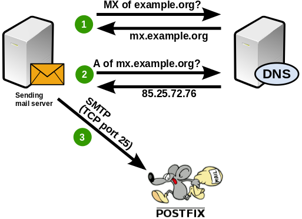

import { Aside } from "@astrojs/starlight/components";

## MX entries

So now you have your working mail server. But how do other mail servers get to know you? The answer lies in the most important service on the internet: [DNS](http://en.wikipedia.org/wiki/Domain_Name_System) – the Domain Name System. Assume that a mail server somewhere on the other end of the internet wants to send an email to `john@example.org`. The server must find out the name (and IP address) of the mail server responsible for the example.org domain. This is how that works:



The remote server queries its DNS server for the MX (Mail eXchanger) record of the “example.org” domain. (If no MX record was found it tries again and asks for A (address) records. That’s a fallback solution.) Let’s run a query for a real domain to get an idea. Let’s ask which servers receive email for …@gmail.com.

```
$> host -t MX gmail.com  
gmail.com mail is handled by 10 alt1.gmail-smtp-in.l.google.com.  
gmail.com mail is handled by 20 alt2.gmail-smtp-in.l.google.com.  
gmail.com mail is handled by 30 alt3.gmail-smtp-in.l.google.com.  
gmail.com mail is handled by 40 alt4.gmail-smtp-in.l.google.com.  
gmail.com mail is handled by 5 gmail-smtp-in.l.google.com.
```

So as a result we get 5 different MX records. Each of them consists of a numeric priority and the host name of the mail server. A mail server would pick the entry with the highest priority (=the lowest number) and establish an SMTP connection to that host. In this example that would be the priority 5 server gmail-smtp-in.l.google.com. If that server could not be reached then the next best server with priority 10 would be used and so on. So all you have to do in your own DNS zone is add an MX entry pointing to your mail server. If you want to run a backup mail server (which is outside of the scope of this tutorial) then you can add a second entry with a an equal or lower priority.

A mistake some people make is using an IP address in MX records. That is not allowed. An MX record always points to a host name. You will have to add an A record for your MX record to point to the actual IP address of your mail server.

<Aside type="tip" title="For fun and science">
In the above example it is very unlikely that a mail server will ever have to use the server with priority 40. Adventurous system administrators can add such a low-priority entry and see who connects to it. An interesting observation is that spammers often try these servers first – hoping that it is just for backup purposes and less restrictive or lazily configured than the main server. If you see someone connecting to the lowest-priority address first without having tried a higher-priority mail server then you can be pretty certain that it’s not a friend who’s knocking at your door.
</Aside>

## Fallback to A entries

It is advised to explicitly name mail servers for your domain in the MX records. If you can’t do that for whatever reason then the remote mail server will just do an A record lookup for the IP address and then send email there. If you just run one server for both the web service and the email service then you can do that. But if the web server for your domain is located at another IP address than your mail server then this won’t work.

## Reverse DNS

Many mail servers check that your forward (name to IP) and reverse (IP to name) lead to the same results. This is how it should look:

example.org —(MX)–> mx.example.org  
mx.example.org —(A)–> 1.2.3.4  
1.2.3.4 —(PTR)–> mx.example.org

(1.2.3.4 in a PTR record is actually 4.3.2.1.in-addr.arpa.)

## IPv6

Fortunately many ISPs finally start to offer IPv6 in their networks. So if you rent a virtual server from a provider then check if you also got an IPv6 address assigned. In that case you also need to have proper DNS records for that as well. Like:

example.org —(MX)–> mx.example.org  
mx.example.org —(AAAA)–> fdeb:37d7:ef39:e063::1  
fdeb:37d7:ef39:e063 —(PTR)–> mx.example.org

Chances are that you haven’t dealt with IPv6 yet. Give it a try. IP addresses may look different at first but you will never again have to deal with odd subnet sizes or NAT. Thank me later. 🙂