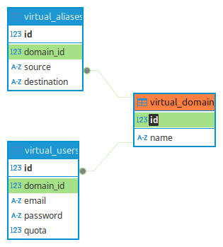

import { Aside } from "@astrojs/starlight/components";

Your mail server must know which domains and email addresses it is responsible for, so it can reject spam sent to
non-existent users. That information will be put into an SQLite database file that will be located at
`/var/vmail/ispmail.sqlite`.

<Aside title="What is SQLite?">
  SQLite is a lightweight, relational database that stores data in tables with rows and columns, just like bigger
  database systems such as MySQL or PostgreSQL. Unlike those, it doesn’t need a permanently running server process —
  instead, it’s just a library your application uses directly, storing everything in a single file. This makes it easy
  to set up, fast, and ideal for small projects.
</Aside>

The database will contain three tables:

- virtual*domains: list of domains (\_name*) that your mail server is responsible for
- virtual_users: list of email addresses that lead to mailboxes. We store the email address, a hashed/salted password
  and optionally a quota to limit the disk space usage.
- virtual*aliases: list of email addresses (\_source*) that forward to other addresses (_destination_)

Creating and accessing the database is done using the _sqlite3_ command. The "3" is because SQLite has some breaking
changes in the past and _sqlite3_ is used to make it clear that this only works for version 3 database files.

On your server run:

```sh
sqlite3 /var/vmail/ispmail.sqlite
```

The database file is created and you will be greeted with:

```
SQLite version 3.46.1 2024-08-13 09:16:08
Enter ".help" for usage hints.
sqlite>
```

At this point you can run SQL queries or use special commands that start with a dot like ".dump" or ".schema". Paste
this SQL block to create the necessary tables:

```sql
CREATE TABLE IF NOT EXISTS virtual_domains (
    id INTEGER PRIMARY KEY AUTOINCREMENT,
    name TEXT NOT NULL
);

CREATE TABLE IF NOT EXISTS virtual_users (
    id INTEGER PRIMARY KEY AUTOINCREMENT,
    domain_id INTEGER NOT NULL,
    email TEXT NOT NULL UNIQUE,
    password TEXT NOT NULL,
    quota INTEGER NOT NULL DEFAULT 0,
    FOREIGN KEY (domain_id) REFERENCES virtual_domains(id) ON DELETE CASCADE
);

CREATE TABLE IF NOT EXISTS virtual_aliases (
    id INTEGER PRIMARY KEY AUTOINCREMENT,
    domain_id INTEGER NOT NULL,
    source TEXT NOT NULL,
    destination TEXT NOT NULL,
    FOREIGN KEY (domain_id) REFERENCES virtual_domains(id) ON DELETE CASCADE
);
```

You have now created the schema. It defines the _fields_ (or _columns_) of each row.

Graphically it looks like:



Paste the following block to create some test data to play with:

```sql
REPLACE INTO virtual_domains (id, name)
VALUES (1, 'example.org');

REPLACE INTO virtual_users (id, domain_id, password, email)
VALUES (
    1,
    1,
    '{BLF-CRYPT}$2y$05$.WedBCNZiwxY1CG3aleIleu6lYjup2CIg0BP4M4YCZsO204Czz07W',
    'john@example.org'
);

REPLACE INTO virtual_aliases (id, domain_id, source, destination)
VALUES (
    1,
    1,
    'jack@example.org',
    'john@example.org'
);
```
