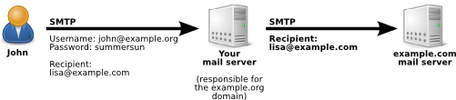
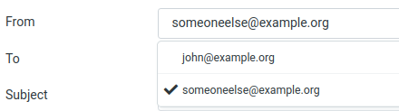

import { Aside } from "@astrojs/starlight/components";

Your mail server is almost ready for use. But one puzzle piece is missing. Your users can receive emails but they cannot
send them yet. That is easy to configure but it needs some important precautions.

Please note that there is a difference on how **users** send emails versus how **mail servers** send emails. For
comparison:

- A **mail server** fetches the _MX_ record for the destination domain of the recipient’s email address from DNS. That
  tells it which mail server to talk to. Then it opens an SMTP connection (TCP port 25) and sends the email.
- An **end user** with a mail client such as Thunderbird, Mutt or Roundcube cannot handle this directly. Mail clients do
  not include any functionality for fetching MX records. In addition, the user is usually on a dynamic IP address that
  other mail servers will not trust and will likely reject. Instead, end users are expected to send their emails through
  their provider’s (your) mail server: they authenticate with their login credentials and then send the message. This
  process is called relaying, because your mail server acts as an intermediary between the user and other mail servers
  on the internet. For security reasons, authentication is required before the user is allowed to send emails. Users are
  also expected to use the TCP port 587 which is called the _submission_ port. More on that later.

Put simply, a mail server will accept an email if…

- it is responsible for handling mail for the recipient’s domain (the domain is listed as a virtual domain), or
- the sender has authenticated successfully with a valid username and password.

I have created two illustrations to explain it.

### Outgoing email (without authentication)

`john@example.org` is on the internet somewhere and wants to send an email to `lisa@example.com` (which is another
domain). Your mail server is not responsible for the _example.com_ domain so it receives John’s email and would have to
forward (relay) it to the actual mail server that is responsible for …@example.com email addresses. This may seem like a
harmless scenario but your mail server must deny that:


Why? Because anyone can claim to be John and make your mail server forward mail. If an attacker (like a spammer) would
send millions of spam emails in John’s name through your server then other organisations will accuse *you* as the
operator of the mail server of spamming. Your mail server would be what people call an
_[open relay](https://en.wikipedia.org/wiki/Open_mail_relay)_. That is not what you want because your mail server would
get blacklisted and you will not be able to send out mail to most other servers. So without any proof that the sender is
indeed John, your server must reject the email.

Try for yourself:

```sh
swaks --server localhost:587 --from john@example.org --to list@example.com -tls
```

Towards the end of the output you will find:

```
 ~> MAIL FROM:<john@example.org>
<~  250 2.1.0 Ok
 ~> RCPT TO:<list@example.com>
<~* 554 5.7.1 <list@example.com>: Recipient address rejected: Access denied
```

### Outgoing email (with authentication)

So how does John prove his identity? He needs to use _authenticated_ SMTP. This is similar to the previous case but
John’s email program will also send his username and password.



We are making sure that his authentication happens over an encrypted connection so John’s password is safe.

Try for yourself and provide a valid user name and password:

```sh
swaks --server localhost:587 --from john@example.org --to list@example.com -tls --auth-user john@example.org --auth-password summersun
```

Towards the end of the output you will find:

```
<~  250 2.0.0 Ok: queued as 7513F1F54B
```

You can even try a wrong password or a non-existing user. That should lead to…

```
<~* 535 5.7.8 Error: authentication failed: (reason unavailable)
```

TODO: a word on $mynetworks. Perhaps in the troubleshooting section later.

## Make Postfix use Dovecot for authentication

Enabling SMTP authentication in Postfix is surprisingly easy. You already configured Dovecot so it knows all about your
users from the SQL database. So let’s just make Postfix use that by telling it to ask the Dovecot server to verify the
username and password. Postfix just needs some extra configuration. Run these commands on the shell:

```
postconf smtpd_sasl_type=dovecot
postconf smtpd_sasl_path=private/auth
postconf smtpd_sasl_auth_enable=yes
```

This enables SMTP authentication and tells Postfix that it can talk to Dovecot through a socket file located at
`/var/spool/postfix/private/auth`. Do you remember that Postfix runs in a sandboxed *chroot* directory? That’s at
/var/spool/postfix. It cannot access any files outside of that directory. But fortunately in a previous section you
edited the /etc/dovecot/conf.d/10-master.conf file and made Dovecot place a socket file into
`/var/spool/postfix/private/auth` to allow communication from Postfix.

TODO: collapsible on anti-spoofing

## Enable encryption

TODO: move this section to a separate page on TLS encryption

We certainly do not want our users to send their password over the wire wihtout encryption. So the following commands
enable encryption, set the key and certificate paths for Postfix. Just run these commands:

```
postconf smtpd_tls_security_level=may
postconf smtpd_tls_auth_only=yes
postconf smtpd_tls_cert_file=/etc/letsencrypt/live/mail.example.org/fullchain.pem
postconf smtpd_tls_key_file=/etc/letsencrypt/live/mail.example.org/privkey.pem
postconf smtp_tls_security_level=may
```

<Aside type="tip" title="smtp or smtpd?">
  Look closely. Some settings start with “smtp\_” and others with “smtpd\_”. That is not a typo. “smtp\_” refers to the
  SMTP _client_. That is the component that sends out emails **from** Postfix **to** other servers. Whereas “smtpd\_”
  means the SMTP _server._ That in turn is the component that **receives** emails **from** other systems – either from a
  remote mail server or one of your users.
</Aside>

The above settings allow encrypted incoming (smtpd\_) and outgoing (smtp\_) connections. But they do not enforce it. If
a remote mail server does not have encryption enabled we will still accept their emails. You may be tempted to enforce
encryption but that would reject email communication with servers who have been configured without encryption.

However the `smtpd_tls_auth_only=yes` setting makes sure that the user’s authentication information (email address and
password) are always encrypted between the user and your mail server.

<Aside type="tip" title="Restrictions">
  In the past you may have configured your _smtpd\_recipient\_restrictions_ to restrict relaying to authenticated users.
  Postfix nowadays has setting called
  “[smtpd\_relay\_restrictions](http://www.postfix.org/postconf.5.html#smtpd_relay_restrictions)” that deals with
  relaying requests in the “RCPT TO” phase of the SMTP dialog. So essentially it works like the good old
  “smtpd\_recipient\_restrictions” but is checked first. _smtpd\_relay\_restrictions_ has a reasonable default so
  authenticated relaying works automatically: `smtpd_relay_restrictions = permit_mynetworks permit_sasl_authenticated
  defer_unauth_destination`
</Aside>

<details class="collapsible">
  <summary>Click here to learn how SMTP authentication works…</summary>

Are you curious how SMTP authentication looks on a low level? You probably are not. But let’s do it anyway. Just once,
so that you get the idea.

```
telnet localhost submission
```

The server will let you in:

```
Trying 127.0.0.1…
Connected to localhost.
Escape character is '^\]'.
220 webmail ESMTP Postfix (Debian/GNU)
```

Say hello:

```
ehlo example.com
```

Postfix will present a list of features that are available for you:

```
250-mailtest
250-PIPELINING
250-SIZE 10240000
250-VRFY
250-ETRN
250-STARTTLS
250-ENHANCEDSTATUSCODES
250-8BITMIME
250-DSN
250-SMTPUTF8
250 CHUNKING
```

Let me briefly explain what these lines mean:

- PIPELINING  
   This is a feature to speed up SMTP communication. Usually the remote system has to wait for a response to every command
  it sends. Pipelining allows the remote server to send several commands in a batch without waiting for a response. Postfix
  will just store these commands and execute them one by one. If you told Postfix to forbid pipelining it would disconnect
  the remote server when it tries to send bulks of commands without waiting for the proper reply. It is mainly a feature
  against rogue senders.
- SIZE 10240000  
   The remote server is allowed to send emails up to 10 MB large. This has long been a common maximum size for emails. However
  nowadays 40 MB or even more are more common sizes because emails have grown larger. Some mail servers even allow 100 MB.
- VRFY  
   Allows remote servers to verify a given name or email address. For example the remote server could send “VRFY john” and
  your server might respond `250 John Doe <john@example.org>`. It can be used to verify that a certain recipient email address
  is deliverable
- ETRN  
   A command that a remote system can send to flush the Postfix queue of mails for a certain domain. It can be used if the
  remote system had technical problems and failed to receive email for a while. Then it could send an ETRN command to make
  your server start sending outstanding emails for that domain. It is rarely used.
- STARTTLS  
   This tells the remote system that it might start switching from this unencrypted to an encrypted connection by sending
  the “STARTTLS” command. It will then start negotiating a TLS-encrypted connection. You could compare it to an HTTP connection
  that suddenly switches over to an encrypted HTTPS connection. The advantage is that you can start talking SMTP on TCP port
  25 and don’t have to open up a second TCP port like 465 which is the “SSMTP” (secure SMTP) port and only accepts encrypted
  connections.
- ENHANCEDSTATUSCODES  
   This enables more three-digit return codes for various conditions. See the [RFC2034](http://tools.ietf.org/html/rfc2034)
  if you are curious.
- 8BITMIME  
   In ancient times SMTP only processed 7-bit characters. You couldn’t transfer special characters like “Ä” or “ß” without
  special encoding. 8BITMIME allows a transmission of emails using 8-bit characters. Still many emails are specially encoded
  using ISO8859-1 or UTF-8.
- DSN  
   It enables DSNs (delivery status notofications) that allows the sender to control the messages that Postfix creates when
  an email could not be delivered as intended.
- SMTPUTF8  
   In addition to 8BITMIME you can use UTF8 encoded characters in header fields.
- CHUNKING  
   This feature (described in [RFC 3030](https://tools.ietf.org/html/rfc3030)) makes sending of large emails more efficient.

However one important line is missing here that would allow us to send our username and password:

```
250-AUTH PLAIN LOGIN
```

We told Postfix to only allow authentication when the connection is encrypted. So we are not offered authentication over
this plain text connection. That’s what we want.

Are you still connected? Okay, good. So we need an encrypted connection using TLS. Using the STARTTLS feature we can
switch over from unencrypted to encrypted without having to reconnect. Enter…

```
STARTTLS
```

And the server replies:

```
220 2.0.0 Ready to start TLS
```

However now it’s getting weird because you would have to speak TLS encryption which is not a language that humans speak.
So let’s quit this using the “QUIT” command and do that differently:

```
QUIT
```

We can use OpenSSL to help us with the decryption. Run:

```
openssl s_client -connect localhost:25 -starttls smtp
```

You will see a lot of output. OpenSSL has connected to TCP port 25 and issued a STARTTLS command to switch to an
encrypted connection. So whatever you type now will get encrypted. Enter:

```
EHLO example.com
```

And Postfix will send a list of capabilities that will look like this:

```
250-PIPELINING
250-SIZE 10240000
250-VRFY
250-ETRN
250-AUTH PLAIN LOGIN
250-ENHANCEDSTATUSCODES
250-8BITMIME
250 DSN
```

And now that we are using an encrypted connection Postfix offers us to authenticate. So let us send the authentication
string with a Base64-encoded password:

```
AUTH PLAIN AGpvaG5AZXhhbXBsZS5vcmcAc3VtbWVyc3Vu
```

Unless you have changed John’s password to something else than “summersun” the server should accept that authentication:

```
235 2.7.0 Authentication successful
```

Excellent. You are logged in through SMTP. You could now send an email to be forwarded to another mail server. I just
wanted to show that authentication works if you use an encrypted connection.

Disconnect from Postfix:

```
QUIT
```

Authentication works. Well done.

## Base64-encoded passwords

Wait a minute. What was that crazy cryptic string? There was no username and password in it. Was it encrypted?

No, that was no encryption. It was merely an _encoded_ version of the username and password. Why that? Well usually in
SMTP you can only transfer ASCII characters. But the password may contain special characters which are not covered by
ASCII. So in the _PLAIN_ method that information is [Base64](https://en.wikipedia.org/wiki/Base64) encoded.

What is actually converted to Base64…

```
NULL-BYTE + USERNAME + NULL-BYTE + PASSWORD
```

So for John’s case you can easily create the Base64 string using:

```
printf '\0john@example.org\0summersun' | base64
```

As a result you will get the exact same string you used above with “AUTH PLAIN”.

</details>

## SMTP versus Submission

Please note that there are two different TCP ports on a mail server that speak SMTP:

| Service name   | SMTP                       | Submission            |
| -------------- | -------------------------- | --------------------- |
| TCP Port       | 25                         | 587                   |
| Encryption     | Optional                   | Mandatory             |
| Authentication | Optional                   | Mandatory             |
| Meant for      | Servers                    | Humans                |
| Used by        | Mail transport agent (MTA) | Mail user agent (MUA) |
| Your home ISP  | may block this port        | will allows this port |

I hope that makes the distinction a bit clearer. Our human users will have to use the _submission_ service.

All Postfix services are declared in the `/etc/postfix/master.cf` file. Please edit the file and look for the
_submission_ section that is commented out by default. Turn that section into the following. Basically I removed the ‘#’
character on all lines of this section and removed the lines with the mua\_\* variables.

```
submission inet n       -       y       -       -       smtpd
  -o syslog_name=postfix/submission
  -o smtpd_tls_security_level=encrypt
  -o smtpd_sasl_auth_enable=yes
  -o smtpd_tls_auth_only=yes
  -o smtpd_reject_unlisted_recipient=no
  -o smtpd_client_restrictions=
  -o smtpd_helo_restrictions=
  -o smtpd_sender_restrictions=
  -o smtpd_relay_restrictions=
  -o smtpd_recipient_restrictions=permit_sasl_authenticated,reject
  -o milter_macro_daemon_name=ORIGINATING
```

Make sure to start the first line in the first column and indent the following lines.

This service uses the “smtpd” daemon (see the last word of the first line) which is the piece of software that responds
if you open an SMTP connection on TCP port 25. But it gets a few extra options set…

- in the /var/log/mail.log log file you will see the connections to the submission port as “postfix/submission” (the
  _syslog_name_ setting above)
- enforce encryption on this port (_smtpd_tls_security_level_)
- enable authentication (_smtpd_sasl_auth_enable_)
- enforce encryption during authentication (_smtpd_tls_auth_only_)
- allow sending emails to recipients outside of this mail server (_smtpd_reject_unlisted_recipient_)
- remove special restrictions (_smtpd\_\*\_restrictions_)
- allow relaying if the sender was authenticated (_smtpd_recipient_restrictions_)
- send the string _ORIGINATING_ to milter services (_milter_macro_daemon_name_) – you can just leave it like that

Restart the Postfix server:

```
systemctl restart postfix
```

Your users can now use the *submission* port to send email. They just use the port 587 in their mail clients instead of
port 25.

Feel free to send a test mail using the submission port and encryption. You will need to install the libnet-ssleay-perl
package first, so that SWAKS can speak TLS:

```
apt install -y libnet-ssleay-perl
swaks --server localhost --to john@example.org \
    --port 587 -tls \
    --auth-user john@example.org \
    --auth-password summersun
```

<Aside type="tip" title="What is Port 465?">
  This TCP port belongs to the “submission over TLS” service. It is used for the submission service but expects an
  encrypted connection from the first byte. This port is hardly ever used so you don’t have to care about it. The
  submission service you just configured is also encrypted but uses the STARTTLS mechanism to switch to a TLS connection
  after the welcome message.
</Aside>

## Protecting against forged sender addresses

A “forged” sender address means that someone claims to be someone else. Let’s say that John has authenticated and the
mail server trusts him. Nothing keeps John from impersonating someone else and sending email in his name? Most email
service providers have restrictions that you can only send emails if the sender matches your actual email address. Let’s
do that, too.

Postfix provides a setting called
[smtpd_sender_login_maps](http://www.postfix.org/postconf.5.html#smtpd_sender_login_maps) for that purpose. From the
“maps” part you can deduce that it expects a _mapping_ again. This time the two columns mean…

- Left column: who you claim to be (email’s sender address)
- Right column: who you logged in as (user name after authentiation)

As we use the email address also as a user name we simply need a mapping where the email address is listed on both
sides. Fortunately we already have a mapping like that: our _email2email_ mapping that we used earlier as a workaround
for catchall forwardings. Let’s reuse it. Please run…

```
postconf smtpd_sender_login_maps=mysql:/etc/postfix/mysql-email2email.cf
```

This sets the parameter both for the SMTP port (25) and the submission port (587). Defining these maps is not enough
though. You also need to make Postfix act on this. Edit the /etc/postfix/master.cf again and in the _submission_ section
add the following option. Make sure the line is indented like all other options:

```
 -o smtpd_sender_restrictions=reject_sender_login_mismatch,permit_sasl_authenticated,reject
```

Restart Postfix after this change:

```
systemctl restart postfix
```

You can now try to send email as a different user than you are logged in. Let’s us swaks again to send a spoofed email:

```
swaks --server localhost --from john@example.com \
    --to john@example.org --port 587 -tls \
    --auth-user john@example.org \
    --auth-password summersun
```

Please note that John’s actual email address is **not** john@example.**com** but john@example.**org**. So it must be
rejected. The server should tell you:

```
~> MAIL FROM:john@example.com
<~ 250 2.1.0 Ok
~> RCPT TO:john@example.org
<~ * 553 5.7.1 john@example.com: Sender address rejected: not owned by user john@example.org
```

Sorry if the mixture of example.org and example.com in my examples makes this guide less readable. But I can’t use any
real world domains here. Please just note that sometimes it’s “.com” and sometimes “.org”.

Of course you can test your new security feature in the Roundcube web mail interface as well. In Settings/Identities you
can create another sender email address as in:



With this wrong sender address any email should get rejected. Your mail.log would read something like:

```
NOQUEUE: reject: RCPT from foo.bar\[…\]:
    553 5.7.1 <someoneelse@example.com>:
    Sender address rejected:
    not owned by user john@example.org;
    from=<someoneelse@example.com> to=<…>
```

<Aside type="tip" title="Allow aliases?">
  If you want to allow users to send as one of their aliases you could create a new \*.cf file with a mapping query like
  this: `SELECT email FROM virtual_users WHERE email='%s' UNION SELECT destination FROM virtual_aliases WHERE
  source='%s'`
</Aside>
