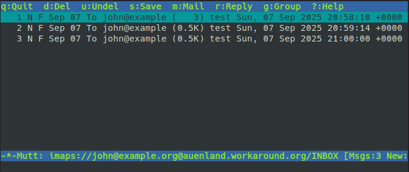
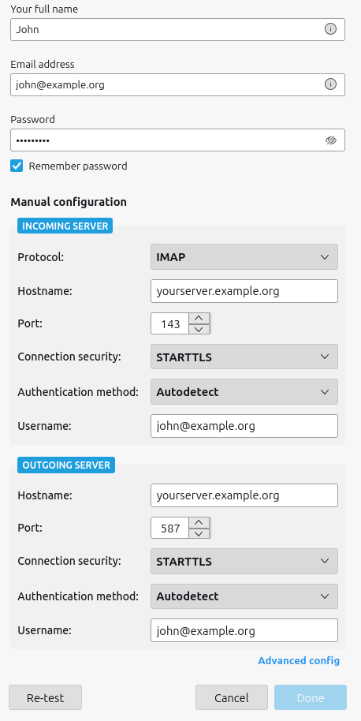

Your mail server relies on two primary protocols. We’ve already covered **SMTP** in detail, which handles the transfer
of emails between servers. The other important protocol is
[**IMAP**](https://en.wikipedia.org/wiki/Internet_Message_Access_Protocol) – the _Internet Message Access Protocol_.

Email clients such as Thunderbird, Roundcube, mutt or the mail apps on your smartphone use IMAP to retrieve and manage
messages. The good news is that you don’t need to configure anything new on the server — it’s already set up. In fact,
even Roundcube (your webmail application) communicates with the server via IMAP to access emails.

## mutt using IMAP

You may not have heard of _mutt_ before. It's like the VIM editor but for mails. Very powerful but it only has a
text-based user interface. For testing IMAP on mail servers it's still a good way because you do not have to set up a
complete account as in Thunderbird.

Give it a try – and as usual replace `webmail.example.org` by your mail server's host name:

```sh title="Run this on your server"
mutt -f imaps://john@example.org@webmail.example.org
```

The connection URL may look a little confusing because of the two “@” characters. Usually _mutt_ expects the format
`imaps://user@server`. The _user_ is `john@example.org` on your server so you get this syntax.

You should get prompted for the password which we set to `summersun`. If you get any certificate warnings then check if
you used the correct server name. If the authentication has succeeded, you will see John's inbox:



These are test emails that you sent earlier using `swaks`. You open an email by pressing `Enter` and get back using `q`.
Mainly we wanted to check that IMAP access works.

## mutt using the file system

Mutt can not only speak IMAP – it can access an inbox (or maildir) on your disk directly as well:

```sh title="Run this on your server"
mutt -f /var/vmail/example.org/john/Maildir/
```

That way you will not be forced to authenticate as you are working with the file system.

## Thunderbird

A typical account setup in Thunderbird looks like:


