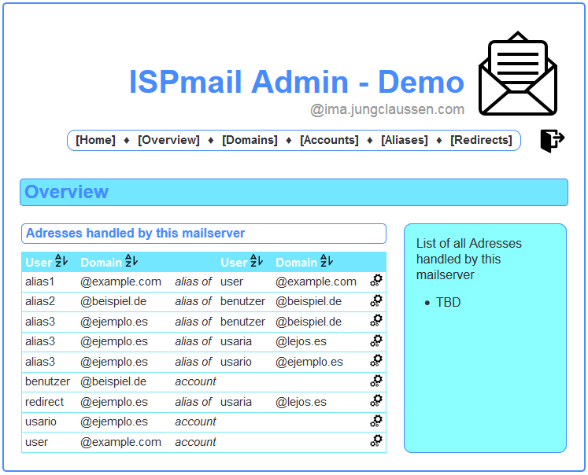
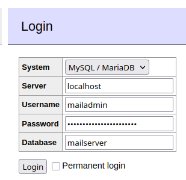

import { Tabs, TabItem } from "@astrojs/starlight/components";

Maybe you already know what you have to do to create mail domains and mail users. After all I tried to explain the
database schema in the section that dealt with preparing the database. But if that wasn’t clear enough let me explain
what you need to do to manage your mail accounts.

## Using SQL queries

The following sections explain the changes and SQL queries you can use for common management tasks:

### Create a new mail domain

Insert a new row into the virtual_domains table and set the `name` to the name of the new domain. (Do not forget to set
up SPF and DKIM.)

```sql
INSERT INTO virtual_domains (name) VALUES ("example.org");
```

### Delete a mail domain

Delete the row from the virtual_domains table that has the right `name`. All aliases and users will automatically be
deleted, too. However the mailboxes will stay on disk at /var/vmail/… and you need to delete them manually.

```sql
DELETE FROM virtual_domains where name='example.org';
```

### Create a mail user

Find out the `id` of the right domain from the virtual_domains table. The insert a new row into the virtual_users table.
Set the domain_id to the value you just looked up in the virtual_domains table. Set the `email` field to the complete
email address of the new user. Create a new password in a shell using the `dovecot pw` command and insert the result
into the `password` field.

```sql
INSERT INTO virtual_users
  (domain_id, email, password)
VALUES
  ((SELECT id FROM virtual_domains WHERE name='example.org'), 'john@example.org','{CRYPT}$2y$05$.We…');
```

### Change the password of a user

Find the row in the virtual_users table by looking for the right `email` field. Create a new password in a shell using
the `dovecot pw` command and insert the result into the `password` field.

```sql
UPDATE virtual_users SET password='{CRYPT}$2y$05$.We…' WHERE email='email@address';
```

### Delete a mail user

Find the row in the virtual_users table by looking for the right `email` field and delete it. The mailbox will stay on
disk at /var/vmail/… and you need to delete it manually

```sql
DELETE FROM virtual_users WHERE email='john@example.org';
```

### Create a mail forwarding

You can forward emails from one (source) email to other addresses (destinations) – even outside of your mail
server. Find out the `id` of the right domain (the part after the `@` of the source email address) from the
virtual_domains table. Create a new row in the virtual_aliases table for each destination (if you have multiple
destination addresses). Set the `source` field to the complete source email address. And set the `destination` field to
the respective complete destination email address.

```sql
INSERT INTO virtual_aliases
  (domain_id, source, destination)
VALUES
  (
    (SELECT id FROM virtual_domains WHERE name='example.org'),
    'melissa@example.org',
    'juila@example.net'
  );
```

### Delete a mail forwarding

Find all rows in the virtual_aliases table by looking for the right `source` email address. Remove all rows that you
lead to `destination` addresses you don’t want to forward email to.

```sql
DELETE FROM virtual_aliases WHERE source='melissa@example.org';
```

## Web interfaces

If you don’t like using SQL queries to manage your mail server you may like to install a web-based management software.
Several developers contributed web interfaces for earlier versions of this guide and they will probably still work
because the database schema has not changed. Your experience with these projects, or links to further projects, is very
welcome in the comments.

### ISPmail Admin

Homepage: [http://ima.jungclaussen.com/](http://ima.jungclaussen.com/)  
Demo: [http://ima.jungclaussen.com/demo/](http://ima.jungclaussen.com/demo/)



### ispmail-userctl

Christian G. has created a text-based program to help you manage your mail accounts. You may like it if you just want a
little help adding accounts and setting passwords but not provide a full blown web interface.

You can find his [Python script at Github](https://github.com/cgzones/ispmail-userctl).

### Adminer

You can also use a basic tool like [Adminer](https://www.adminer.org/) to manage the tables if you don't want to type
out SQL. To set it up:

```sh title="Run this on your server"
apt install -y adminer
a2enconf adminer
systemctl reload apache2
```

Now Adminer is available as `https://mailserver.example.org/adminer` and allows you to login:



After login this is how the interface looks like:


