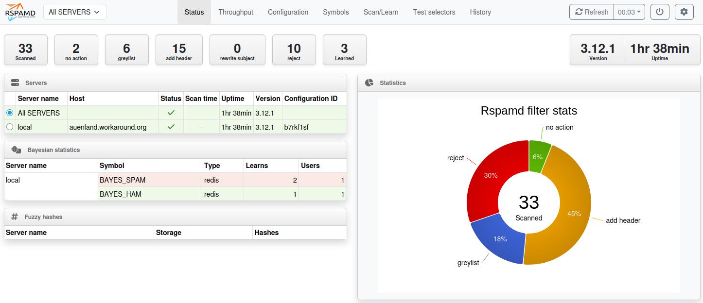

import { Aside } from "@astrojs/starlight/components";

<Aside type="tip" title="Optional feature">
  This feature is completely optional. Just skip this page if you don't care about filtering out spam emails.
</Aside>

You have come a long way in this guide and your mail server is already fully functional. Now it’s time to deal with
filtering out incoming spam emails. I found that [rspamd](https://rspamd.com/) is well-performing choice for that
purpose both in speed and detection. rspamd keeps a permanent process running on your mail server that listens to
connections from Postfix using the [milter](http://www.postfix.org/MILTER_README.html) (=**m**ail f**ilter**) protocol.
Every time an email enters your system, Postfix will send it to rspamd to have its content checked. rspamd runs a lot of
checks on the email and computes a total score. The higher the score – the more likely it it spam.

## Make Postfix use rspamd

Let’s tell Postfix to send all incoming email through rspamd:

```
postconf smtpd_milters=inet:127.0.0.1:11332
```

For testing we can use a sample spam email that comes with SpamAssassin. It is called GTUBE (Generic Test
for Unsolicited Bulk Email). It contains a certain artificial pattern that is recognized as spam by SpamAssassin. Do you
know EICAR.COM to test virus scanners? This is the same thing for spam.

Get the GTUBE file, send it to John and let's see what happens:

```sh
wget http://spamassassin.apache.org/gtube/gtube.txt
sendmail john@example.org < gtube.txt
journalctl -fu postfix
```

You will find something like this at the end of the log file:

```
postfix/cleanup[1386519]: 2B72320126: message-id=<GTUBE1.1010101@example.net>
postfix/cleanup[1386519]: 2B72320126: milter-reject: END-OF-MESSAGE from localhost[127.0.0.1]: 5.7.1 Gtube pattern; from=<root@mailserver> to=<john@example.org>
postfix/cleanup[1386519]: 2B72320126: to=<john@example.org>, relay=none, delay=0.16, delays=0.16/0/0/0, dsn=5.7.1, status=bounced (Gtube pattern)
```

**milter-reject** tells that the rspamd recommended to reject the email. It gave the reason `5.7.1 Gtube pattern`.
SMTP/LMTP always uses such three digit codes. They are defined in [RFC 3463](https://tools.ietf.org/html/rfc3463). The
first digit is most important:

- 2 = Success
- 4 = Temporary failure (come back later)
- 5 = Permanent failure (do not try again in this way)

So `5.7.1` tells us that the result code is a permanent failure in delivery. If you looked up the RFC you would find
that the 7 stands for an issue regarding the security policy. So it’s not a technical failure but instead a
security-relevant component on the system has rejected the email. That’s what rspamd did. It even told us the reason:
`Gtube pattern`. So you see that rspamd knows about the Gtube spam test pattern and reacts as expected.

That email will not be delivered to John. Instead Postfix will reject it at the doorstep – while it is still in the SMTP
communication with the sending server. It just hung up the phone and now it's the sending server's problem to deal with.

It is important to either reject an email right away or to deliver it to a user. Never accept an email and later decide
to complain about it to the alleged sender. Trust me: the sender you see on a spam email is never the bad guy who sent
it. You would complain to the wrong person which is called
[backscatter](<https://en.wikipedia.org/wiki/Backscatter_(email)>).

## Spam scores

rspamd will however not reject all spam email. It computes a score that tells how likely a certain email is spam. You
can tell it which scores you would accept, flag as spam or make the incoming email get rejected. Rspamd checks incoming
emails in various ways. Take a look at the `/etc/rspamd/actions.conf` file:

```
actions {
  reject = 15;
  add_header = 6;
  greylist = 4;
}
```

These are the default actions. If rspamd computes a score of at least 15 then the email will get rejected at the
doorstep just like the _Gtube pattern_ in the previous test. Any other score above 6 will add a line "X-Spam: Yes" so
that your mail software can detect them and maybe file the email to a different folder. And any other score above 4 will
trigger [greylisting](<https://en.wikipedia.org/wiki/Greylisting_(email)>) which is a mechanism that temporarily rejects
the email with a 4.x.x code and waits if the sending server will try again. After a waiting time of a few minutes
greylisting will accept the email. The idea is to reject email from systems that do not have a sending queue. Malware
like on infected Wind\*ws computers used to try sending an email just once which triggered greylisting and successfully
rejected the spammer. But even malware programmers have learned and may try again after a few minutes thus circumventing
greylisting. Your mileage may vary. The problem with greylisting is that the recipient has to wait a couple of minutes
for the email to be delivered which may be bothering the users.

## X-Spam header

An email consists of **headers** and the actual **body**. Your users will usually only see common header information
like the *subject*, the *sender*, the *recipient* and the *time* the email was sent. But there is way more information
like the route the email travelled. Mail software can even add arbitrary **extended headers** that start with `X-`.
There is one specific header that rspamd adds for us if it finds a spam email:

```
X-Spam: Yes
```

<details class="collapsible">
  <summary>Click here to dive deeper into rspamd's scores…</summary>

rspamd can add an `X-Spamd-Result` header containing the various criteria that added to the total score:

```
X-Rspamd-Server: mailserver
X-Rspamd-Queue-Id: C22E55A005B3
X-Spamd-Result: default: False [11.55 / 15.00]
 R_PARTS_DIFFER(0.27)[63.4%]
 FROM_NO_DN(0.00)[]
 RCVD_COUNT_ZERO(0.00)[0]
 R_DKIM_NA(0.00)[]
 FUZZY_DENIED(12.00)[1:19305c7fdd:1.00:bin,1:35699594fd:0.91:txt]
 RBL_SENDERSCORE(2.00)[55.181.23.94.bl.score.senderscore.com]
 ARC_NA(0.00)[]
 RCPT_COUNT_ONE(0.00)[1]
 RCVD_TLS_ALL(0.00)[]
 FROM_EQ_ENVFROM(0.00)[]
 R_SPF_SOFTFAIL(0.00)[~all]
 BAYES_HAM(-2.71)[98.75%]
 TO_MATCH_ENVRCPT_ALL(0.00)[]
 MIME_GOOD(-0.10)[multipart/related,multipart/alternative,text/plain]
 MID_RHS_MATCH_FROM(0.00)[]
 ASN(0.00)[asn:16276, ipnet:94.23.0.0/16, country:FR]
 TO_DN_NONE(0.00)[]
 DMARC_POLICY_SOFTFAIL(0.10)[Chronopost.fr : No valid SPF, No valid DKIM,none]
 SUBJECT_ENDS_EXCLAIM(0.00)[]
X-Spam: Yes
```

Enable those additonal headers:

```sh
cat > /etc/rspamd/local.d/milter_headers.conf << EOF
extended_spam_headers = true;
EOF
systemctl reload rspamd
wget http://spamassassin.apache.org/gtube/gtube.txt
swaks --server mailserver.example.org --to john@example.org --body @gtube.txt
```

What you just did:

- create a new file at `/etc/rspamd/local.d/milter_headers.conf` that extends rspamd's milter configuration
- restart rspamd to make it active
- get the GTUBE anti-spam test file (if you haven't already)
- send that spam test to John's email address. Please use your actual mail server name here instead of
  `mailserver.example.org`. It is important not to use `localhost` because rspamd will only add those headers for emails
  coming from the internet.

Each of the uppercase symbols like *FROM_HAS_DN* means that a certain detection rule of rspamd was triggered. It does
not necessarily mean something bad about the email. For example _R_SPF_ALLOW_ has a negative score that lowers the total
score because it is something good about the email. There are a several symbols with a 0.00 score. These do not change
the score but show you what rspamd has found. But if you consider certain criteria good or bad then you can
[define your own scores](https://docs.rspamd.com/configuration/metrics/#configuring-scores-and-actions) for them.

</details>

## Sending spam to the Junk folder

Your users will not realize that their spam emails have an added `X-Spam: Yes` header. It is not shown in their mail
client. Nor does it move the email out of the inbox into their spam folder. Such emails just appear in their inbox. So
let’s be nice and move spam emails to the user's _Junk_ folder automatically. Dovecot has support
for [Sieve](<https://en.wikipedia.org/wiki/Sieve_(mail_filtering_language)>) filtering rules that are if-then scripts
that get run whenever an email arrives.

John could create such a Sieve script for himself (using the Roundcube webmail interface). But let's find a solution
that applies to all your users. Create a new config file (`/etc/dovecot/conf.d/99-ispmail-sieve.conf`) that tells
Dovecot:

- whenever an email is delivered to our users, run an additional Sieve script
  (`/etc/dovecot/sieve/spam-to-junk-folder.sieve`)
- the Sieve functionality is enabled during LMTP (when an email is passed on from Postfix to Dovecot)
- the user gets a _Junk_ folder created in his mailbox and is subscribed to it so that it appears in their mail program

```sh
# Create a new config file for spam handling
cat > /etc/dovecot/conf.d/99-ispmail-sieve-movetojunk.conf << 'EOF'
sieve_script spam-to-junk-folder {
  driver = file
  type = after
  path = /etc/dovecot/sieve/spam-to-junk-folder.sieve
}

# Enable the execution of Sieve rules when Postfix sends an email to Dovecot over LMTP
protocol lmtp {
  mail_plugins {
    sieve = yes
  }
}

# Make sure that every user has a Junk folder and is subscribed to it
namespace inbox {
  mailbox Junk {
    special_use = \Junk
    auto = subscribe
  }
}
EOF

# Restart Dovecot
systemctl reload dovecot
```

Now we need to create that Sieve script (`/etc/dovecot/sieve/spam-to-junk-folder.sieve`) that is run on each delivery.
Its job is to check if the `X-Spam: yes` header is present. If it is, the email is filed into the user's `Junk` folder.

```sh
# Create the directory for Sieve files
mkdir -p /etc/dovecot/sieve

# Create the Sieve script to move Spam mails to the user's Junk folder
cat > /etc/dovecot/sieve/spam-to-junk-folder.sieve << 'EOF'
require ["fileinto"];

if header :contains "X-Spam" "Yes" {
 fileinto "Junk";
 stop;
}
EOF
```

Let's give it a test using Swaks. This time we impersonate Postfix and inject an email with an `X-Spam: yes` header
directly into Dovecot using the LMTP socket:

```sh
swaks --to john@example.org --header-X-Spam "yes" --socket /var/spool/postfix/private/dovecot-lmtp --protocol LMTP
journalctl -fu dovecot
```

It should read:

```
dovecot[1434406]: lmtp(john@example.org)<1436598><kh4lDNl26Wi26xUA5ANL0g>: sieve: msgid=<20251010211257.1436597@mailserver>: fileinto action: stored mail into mailbox 'Junk'
```

<details class="collapsible">
  <summary>Click here to get more detailed logs…</summary>

If you find that the delivery to the _Junk_ folder did not work, you may want to increase the log level. Uncomment the
line

```
log_debug=category=sieve
```

in the `99-ispmail-sieve.conf` file.

That will give you a much deeper insight of what Dovecot has been doing. Restart Dovecot, send another email with
_swaks_ and check the logs again:

```sh
systemctl reload dovecot
journalctl -eu dovecot
```

</details>

The alleged spam email has been moved to the _Junk_ folder just like we wanted.

## Automatic spam training

One of rspamd’s features is analyzing word patterns using probability theory. That functionality is contained in its
[statistical module](https://rspamd.com/doc/configuration/statistic.html). (Yes, the name is misleading.) Essentially
you show rspamd lots of **ham** (good) and **spam** (bad) emails and its detection gets better over time.

Rspamd stores that training data (among other information) in a local [Redis](https://redis.io/) database.

<details class="collapsible">
  <summary>Click here to learn more about Redis…</summary>

Redis is a kind of database system. It is way more limited than a traditional SQL database because it just stores keys
and values. There aren’t several fields/columns like in SQL. But it is lightning fast the way it works. On my aged
server it handles around 50,000 requests per second. It gets it speed from its simplicity and from keeping the data in
RAM. So it doesn’t access the disk to fetch information. (But it copies its data to disk frequently to prevent data
loss.) People use Redis as a cache or for very fast lookups of simple data structures. And so
[does rspamd](https://docs.rspamd.com/configuration/redis/).

</details>

You have already installed the "redis-server" package earlier. It has started automatically and listens to incoming
connections on TCP port 6379 on localhost. You just need to tell rspamd to use it:

```sh
# Create a config file to enable automatic spam training
cat > /etc/rspamd/local.d/classifier-bayes.conf << 'EOF'
# Store training data in the Redis database
servers = "127.0.0.1:6379";
backend = "redis";

# Enable automatic training
autolearn = true;   # if rspamd is sure that an email is spam, it will be learned
min_learns = 200;   # do not trust the data before at least 200 mails have been learned
EOF

# Restart rspamd
systemctl restart rspamd
```

You will start with an empty training database. But that is not as bad as it sounds, because rspamd checks many
properties of an email to determine if an email is ham or spam. If there is enough evidence that an email is likely ham
or spam, then autolearning adds it to its training database.
The [rspamd documentation](https://rspamd.com/doc/configuration/statistic.html) has further examples how to fine-tune
auto learning. After a few hundred emails the training will contribute towards a better detection rate.

The defaults for auto-learning are:

- score &lt; -0.5 ➞ learn as ham/good
- score &gt; 4.0 ➞ learn as spam/bad

See [rspamd's documentation](https://docs.rspamd.com/configuration/statistic/#statistics-configuration) if you want to
fine-tune that.

```sh
rspamc stat
```

Bayes spam checking will not work before it learned at least 200 spam and ham emails. Teaching rspamd fewer emails or
just spam emails will not work. This is defined by the *min_learns* variable defined in /etc/rspamd/statistic.conf.

In the output you will find lines beginning with "Statfile" like these…

```
Statfile: BAYES_SPAM type: redis; length: 0; free blocks: 0;
    total blocks: 0; free: 0.00%; learned: 21164;
    users: 214; languages: 0

Statfile: BAYES_HAM type: redis; length: 0; free blocks: 0;
    total blocks: 0; free: 0.00%; learned: 1411;
    users: 62; languages: 0
```

(Don't worry about the `length: 0`. That seems to be a [bug](https://github.com/rspamd/rspamd/issues/3105) that has been
ignored since 2019. Checking the actual contents of the Redis database reveals that there is actually data stored.)

## Per-user spam training

Usually the training database applies to all incoming emails for **all** users. But you split it up so that each
recipient gets their own training.

**Advantage:** users work differently. Some have subscribed to a sales newsletter and now believe that marking it as
spam gets them unsubscribed. Yes, that’s stupid but can thoroughly confuse the spam detection. Also you might not be
very interested in "blue pills" while others are.

**Disadvantage:** training still requires many ham and spam mails before it has any effect. So unless a user gets 200
samples of good and bad emails, spam detection cannot work. Many users will not get that many emails so due to the lack
of spam training the detection will not be improved. For a friends-and-family server I would suggest not to use it.

If you decide you want to use per-user spam training then add/edit the file `/etc/rspamd/local.d/classifier-bayes.conf`
and insert:

```
users_enabled = true;
```

## Learning from user actions

Now we are getting to something really cool. Imagine you receive a spam email in your inbox that Rspamd didn’t catch.
You could just move it to your Junk folder — but that wouldn’t help Rspamd learn to recognize that kind of spam in the
future. Luckily, we can change that.

Let’s tell Dovecot that moving emails **into** the Junk folder teaches rspamd instantly that the email is **spam**. And
if the email is moved **out of** the Junk folder, then learn it as **ham**. That can be done using another _sieve_
script. Sieve scripts not only apply when an email is delivered. Thanks to Dovecot's
[IMAPSieve](https://doc.dovecot.org/2.4.1/core/plugins/imap_sieve.html#imapsieve-plugin-imap-sieve/) plugin, such
scripts can also be triggered if a user moves a mail between folders.

The setup requires three parts:

1. Tap into the IMAP connection to know when an email is moved out of or into the Junk folder.
2. Create Sieve scripts that call Shell scripts.
3. Create Shell scripts that actually call `rspamd learn_ham` or `rspamd learn_spam`.

Or as a diagram:


Create a new Dovecot configuration file (`99-ispmail-imapsieve.conf`) to enable the required functionality and add
triggers on the Junk folder:

```sh
cat > /etc/dovecot/conf.d/99-ispmail-imapsieve.conf << 'EOF'
# Enable the imap_sieve plugin
protocol imap {
  mail_plugins {
    imap_sieve = yes
  }
}

# Allow the use of the pipe plugin to send mails to shell scripts
sieve_plugins {
  sieve_extprograms = yes
  sieve_imapsieve = yes
}

sieve_global_extensions {
  vnd.dovecot.pipe = yes
}

# Where to look for Sieve scripts that use the Pipe functionality
sieve_pipe_bin_dir = /etc/dovecot/sieve

# Moved into Junk? -> Learn as spam.
mailbox Junk {
  sieve_script spam {
    type = before
    cause = copy
    path = /etc/dovecot/sieve/learn-spam.sieve
  }
}

# Moved out of Junk? -> Learn as ham.
imapsieve_from Junk {
  sieve_script ham {
    type = before
    cause = copy
    path = /etc/dovecot/sieve/learn-ham.sieve
  }
}
EOF

systemctl reload dovecot
```

The first rule tells Dovecot to run a Sieve script at `/etc/dovecot/sieve/learn-spam.sieve` whenever an email is moved
**into** a user’s "Junk" folder. We will create that Sieve script in a minute.

The second rule sets the other way. Whenever an email is moved **out** of the "Junk" folder to any other folder, then
the `/etc/dovecot/sieve/learn-ham.sieve` Sieve script is called.

Let's create both Sieve scripts:

```sh
# Create spam learning script
cat > /etc/dovecot/sieve/learn-spam.sieve << 'EOF'
require ["vnd.dovecot.pipe", "copy", "imapsieve"];
pipe :copy "rspamd-learn-spam.sh";
EOF

# Create ham learning script
cat > /etc/dovecot/sieve/learn-ham.sieve << 'EOF'
require ["vnd.dovecot.pipe", "copy", "imapsieve", "variables"];
pipe :copy "rspamd-learn-ham.sh";
EOF

# Compile the Sieve scripts
sievec /etc/dovecot/sieve/learn-spam.sieve
sievec /etc/dovecot/sieve/learn-ham.sieve

# Fix permissions
chmod u=rw,go= /etc/dovecot/sieve/learn-{spam,ham}.{sieve,svbin}
chown vmail:vmail /etc/dovecot/sieve/learn-{spam,ham}.{sieve,svbin}
```

By the way: the `sievec` comment compiles the `*.sieve` file into `*.svbin` files that Dovecot can work with. If you are
not doing this step, Dovecot will do that during runtime. However then you need to make sure that Dovecot has proper
write permissions to the target directory. The `sievec` command is also useful because it scans a `*.sieve` file for
errors. So if your changes do not seem to work it might be worth compiling them and looking for errors.

And the last step is to create the simple shell scripts that do the actual spam/ham training:

```sh
# Create the shell script for learning spam
cat > /etc/dovecot/sieve/rspamd-learn-spam.sh << 'EOF'
#!/bin/sh
# Receives an email from Dovecot's Sieve script and pipe it into rspamc
exec /usr/bin/rspamc learn_spam
EOF

# Create the shell script for learning ham
cat > /etc/dovecot/sieve/rspamd-learn-ham.sh << 'EOF'
#!/bin/sh
# Receives an email from Dovecot's Sieve script and pipe it into rspamc
exec /usr/bin/rspamc learn_ham
EOF

# Fix permissions of the shell scripts
chmod u=rwx,go= /etc/dovecot/sieve/rspamd-learn-{spam,ham}.sh
chown vmail:vmail /etc/dovecot/sieve/rspamd-learn-{spam,ham}.sh
```

I am sure you are eager to try it out. Of course we don't blindly believe that it works. We want to see it do its job.
Usually you will not see much unless you increase the log level to _debug_. Let's do that:

```sh
cat > /etc/dovecot/conf.d/99-ispmail-sieve-debug.conf << 'EOF'
# Enable detailed logging of Sieve scripts
log_debug=category=sieve
EOF

# Restart Dovecot
systemctl reload dovecot

# Follow Dovecot's logs
journalctl -fu dovecot
```

Now open your IMAP client (Thunderbird, Evolution, Roundcube, mutt or whatever you prefer) and drag an email to John's
Junk folder. The mail log will show a lot of things that are going on. You will see a whole screen full of things that
are going on. Some relevant lines:

```
imap(john@example.org)<1737478><FnGIR2BBA/5bar5M>: Debug: Mailbox Junk: imapsieve: storage spam: file: Using Sieve script path: /etc/dovecot/sieve/learn-spam.sieve
imap(john@example.org)<1737478><FnGIR2BBA/5bar5M>: Debug: Mailbox Junk: imapsieve: storage spam: file: script 'learn-spam': Opened from 'spam'
imap(john@example.org)<1737478><FnGIR2BBA/5bar5M>: Debug: sieve: Opening script 1 of 1 from 'spam/learn-spam'
imap(john@example.org)<1737478><FnGIR2BBA/5bar5M>: Debug: sieve: Executing script from '/etc/dovecot/sieve/learn-spam.svbin'
imap(john@example.org)<1737478><FnGIR2BBA/5bar5M>: Debug: sieve: action pipe: running program: rspamd-learn-spam.sh
imap(john@example.org)<1737478><FnGIR2BBA/5bar5M>: Debug: sieve: uid=19: Finalize pipe action (status=ok, action_status=ok, commit_status=ok, pre-commit=yes)
imap(john@example.org)<1737478><FnGIR2BBA/5bar5M>: Debug: sieve: execute exec:/etc/dovecot/sieve/rspamd-learn-spam.sh (1737484): Connected to program
imap(john@example.org)<1737478><FnGIR2BBA/5bar5M>: Debug: sieve: uid=19: pipe action: piped message to program 'rspamd-learn-spam.sh'
```

Something similar should happen when you drag the email back from the Junk folder to the Inbox.

If you are happy and see no errors (they are highlighted in red), then switch off the debugging again.

## Logging

rspamd keeps a verbose log of its actions in /var/log/rspamd/rspamd.log. If a user complains that a certain email got
blocked or at least flagged as spam then take a look at this log. You can match the /var/log/mail.log with it by
comparing the Postfix queue ID. Those are the 12-digit hexadecimal number like "**95CE05A00547**". Those IDs can be
found in the rspamd.log, too:

```
<40985d>; task; rspamd_task_write_log: id: <undef>, qid: <**95CE05A00547**>,  ip: 12.13.51.194, from: <…>, (default: F (no action):  [3.40/15.00]  [MISSING_MID(2.50){},MISSING_DATE(1.00){},MIME_GOOD(-0.10){text/plain;},ARC_NA(0.00){},ASN(0.00){asn:8220,  ipnet:212.123.192.0/18,  country:GB;},FROM_EQ_ENVFROM(0.00){},FROM_NO_DN(0.00){},RCPT_COUNT_ONE(0.00){1;},RCVD_COUNT_ZERO(0.00){0;},RCVD_TLS_ALL(0.00){},TO_DN_NONE(0.00){},TO_DOM_EQ_FROM_DOM(0.00){},TO_MATCH_ENVRCPT_ALL(0.00){}]),  len: 181, time: 16.000ms real, 6.385ms virtual, dns req: 0, digest:  <69b289a82827c11f759837c033cd800a>, rcpts: <…>, mime_rcpt:  <…>
```

## Autoexpunge

Andi Olsen pointed out that Dovecot has introduced a [feature](https://wiki.dovecot.org/MailboxSettings) to
automatically delete emails in a folder that reach a certain age. This is especially useful for the "Trash" and "Junk"
folders. To enable this feature, create yet another configuration file:

```sh
cat > /etc/dovecot/conf.d/99-ispmail-autoexpunge.conf << 'EOF'
# Remove mails from the Junk and Trash folders after 30 days
mailbox Junk {
  special_use = \Junk
  auto = subscribe
  mailbox_autoexpunge = 30d
}
mailbox Trash {
  special_use = \Trash
  auto = subscribe
  mailbox_autoexpunge = 30d
}

# Make expunging more efficient
mailbox_list_index = yes
mail_always_cache_fields = date.save
EOF

# Restart Dovecot
systemctl reload dovecot
```

## rspamd's web interface

rspamd comes with a neat bonus feature: a web interface. It allows you to check emails for spam, get statistics and
fine-tune scores. It is already installed and enabled by default and expects HTTP (not HTTPS!) requests on port 11334 on
the localhost interface. I suggest you add a simple proxy configuration to your already working HTTPS-enabled web mail
configuration to get access.



You can either create a new virtual host configuration or just edit the
/etc/apache2/sites-enabled/000-default-le-ssl.conf file. Anywhere within the *VirtualHost* tags add:

```
<Location /rspamd>
  Require all granted
</Location>

RewriteEngine On
RewriteRule ^/rspamd$ /rspamd/ [R,L]
RewriteRule ^/rspamd/(.*) http://localhost:11334/$1 [P,L]
```

You also need to enable Apache’s modules for HTTP proxying and rewriting:

```sh
# Enable the required Apache modules
a2enmod proxy_http
a2enmod rewrite

# Restart Apache
systemctl restart apache2
```

This piece of configuration will forward any requests to `https://webmail.example.org/rspamd` to localhost:11334 and
thus give you access to the rspamd web interface.

The web interface is password protected. Let’s generate a new access password, hash it and add it to rspamd's
configuration:

```sh
# Generate a random password that is 15 characters long
PW=$(pwgen 15 1)

# Create a hash of that password
HASH=$(rspamadm pw -p $PW)

# Add the hashed password to rspamd's configuration
echo "password = \"$HASH\"" > /etc/rspamd/local.d/worker-controller.inc

# Restart rspamd
systemctl restart rspamd

# Show the password
echo "Please note the password for the web interface: $PW"
```

This gives you a password like "sae8thaoTaengeo". If everything went as expected you should now be able to access the
rspamd web interface at `https://mail.example.org/rspamd` (of course you will use your own server name here).
