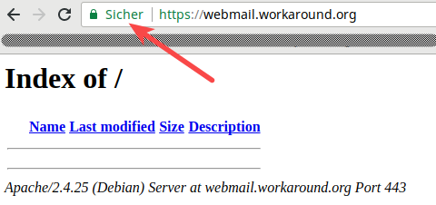

import { Aside } from "@astrojs/starlight/components";

<Aside type="tip" title="TLS is SSL">
  If you are unfamiliar with the abbreviation “TLS“: it is the name successor to SSL but works one the same principle.
  SSL 3.0 was just renamed to TLS 1.0 in 1999. Every new version of TLS deprecates unsafe encryption methods (ciphers)
  of previous versions. You will still find people calling it _SSL_.
</Aside>

The internet is not a friendly place where you can trust people. If you send data over the internet there is a pretty
good chance someone intercepts it. You don’t want that. Our best weapon against that is transport encryption. All you
need is to create an encryption _key_ and a _certificate_ for Postfix (SMTP), Dovecot (IMAP/POP3) and Apache (HTTPS). If
you are confused why that requires a key and certificate then please consider reading the Wikipedia about
[public-key cryptography](https://en.wikipedia.org/wiki/Public-key_cryptography). The single most important detail here:
nobody but you must have access to the private key.

<Aside type="caution">
  Do not use different certificates for Postfix and Dovecot. At least the MacOS mail client would refuse your connection
  with confusing error messages. You will be safe If you follow this guide.
</Aside>

## What makes mail clients trust a certificate?

Your client’s operating system contains a list of “trusted” certificate authorities. Sometimes that list is located in a
central location for all applications. And sometimes a browser comes with its own list. A certificate signed by any of
those organization is fully trusted. Yes, your browser trusts companies you probably have never heard of. And so does
your mail client if you use software like Thunderbird instead of using web mail. The tricky part is not the technology.
Everyone with some knowledge about certificates can create their own authority. Mathematically your certificates are
just as good as anyone else’s. The tricky part is to convince browser manufacturers to trust them and add your
certificates to their trust list.

Those organization claim to do checks (in exchange for money) whether you are the righteous owner of a certain domain.
These checks have sometimes failed so badly that they popped up in the news. Ten years ago a nerd
[requested](https://bugzilla.mozilla.org/show_bug.cgi?id=647959) to get trusted by Firefox with his “Honest Achmed’s
Used Cars and Certificates” authority. It was fun to watch the developers struggle with arguments why Achmed would be
any worse than authorities like
[Türktrust](https://arstechnica.com/information-technology/2013/01/turkish-government-agency-spoofed-google-certificate-accidentally/)
or [Verisign](https://en.wikipedia.org/wiki/Verisign#2001:_Code_signing_certificate_mistake) (who failed so hard one
must wonder why they are still in business).

In 2012 [two Mozilla employees](https://en.wikipedia.org/wiki/Let%27s_Encrypt#History) decided to do something about
that. They came up with the idea of a non-profit certificate authority. The world needed encryption everywhere and
people should no longer shy away from it because getting certificates cost money. Two years later the service was ready
and everyone could get a free certificate valid for 90 days. An automated process renewed the certificate in time so
there was no hassle. (They surely deserve a [donation](https://letsencrypt.org/donate/) for the many years of service to
the internet community.)

## Where is the certificate used?

You guessed it, we will need our own certificate. It will be used in three places:

1. the webmail interface (driven by the Apache web server)
2. Postfix (to encrypt SMTP communication where possible)
3. Dovecot (to encrypt IMAP/POP3 communication and deny any unencrypted traffic)

A single certificate (per domain) can and should be used by all three pieces of software.

## Choosing a hostname for your mail server

Your mail server will be able to serve emails in many domains. But a certificate is usually issued for a single
[fully-qualified domain name](https://en.wikipedia.org/wiki/Fully_qualified_domain_name) like “mail.example.org”. The
_common name_ is an important part of the certificate. That attribute must correspond to the host name you use during
communication or else the certificate is rejected. Hmmm, many domains but only one name is allowed on a certificate? How
do we deal with that?

### Option 1: a generic name and a single certificate

The simple solution is to take a generic name. The German ISP Hetzner for example uses the name “mail.your-server.de”
for all customers and their domains. And there are many examples of such an approach. Experience shows that most users
do not care about the hostname as long as they get their emails. So I would generally recommend this approach due to its
simplicity.

### Option 2: multiple names/certificates & SNI

Some people however want to give their mail server as many names as they have domains. Suppose that you have three
domains: example.org, example.net and example.com. Users of example.org can use mail.example.org while users of
example.net use mail.example.net. As you can imagine this would not work if you had a single certificate. After all
which name would you use as a _common name_ there? If you used “mail.example.org” then talking to your server by the
name “mail.example.net” would lead to a certificate error.

So your mail server needs multiple certificates – one for each host name. And depending on how a user connects to your
server you need to send the matching certificate. If the user wants to speak to “mail.example.org” then your server
needs to send the certificate for “mail.example.org”. Fortunately that problem has been addressed by a technique called
[Server Name Indication (SNI)](https://en.wikipedia.org/wiki/Server_Name_Indication). A client talks to the server and
even before the encrypted connection is established it tells the server that it expects a certificate for the intended
host name. The server can then load the matching certificate and initiate the encryption process.

SNI has long been a problem for mail servers. The mail user agent (e.g. Thunderbird) needs to support it as well as
Postfix and Dovecot. Postfix has finally added SNI in version 3.4 so that we can use it.

While adding multiple host names needs extra work, it also has a benefit. If you want to move domains to other servers
(e.g. when upgrading your server) you can move one domain at a time.

<Aside type="tip" title="More security?">
  If you wish to further enhance security against [man-in-the-middle
  attacks](https://en.wikipedia.org/wiki/Man-in-the-middle_attack) you should get acquainted
  with [DNSSEC](https://en.wikipedia.org/wiki/Domain_Name_System_Security_Extensions) and [DANE](https://en.wikipedia.org/wiki/DNS-based_Authentication_of_Named_Entities).
  Also take a look at
  the [smtp\_dns\_support_level](http://www.postfix.org/postconf.5.html#smtp_dns_support_level) parameter in Postfix.
</Aside>

## Preparing the Apache web server for HTTP

Let’s start with the web server. As an example I will assume that you want to offer a host name **webmail.example.org**
to your users. Of course your server will have another name in a domain that you control. I will use that example
throughout the tutorial though and keep that name printed in **bold** letters to remind you that you have to use your
own host name.

Do you just want to play around with your new server and not use any real domain yet? No problem. Then use
[nip.io](https://nip.io/). If your IP address is 1.2.3.4 then you can use 1.2.3.4.nip.io as a domain name that points to
your server. (There used to be another domain xip.io for that purpose but it died in mid-2021.) Another service like
that which also supports IPv6 is [sslip.io](https://sslip.io/).

If you have an actual domain then set up a DNS “A” and “AAAA” (if you use IPv6) record for that host name pointing to
your server’s IP address.

First you need a web root directory for that host name:

```
mkdir /var/www/webmail.example.org
chown www-data:www-data /var/www/webmail.example.org
```

Next you need to create a virtual host configuration file. Apache on Debian uses a neat system to manage virtual hosts:

- `/etc/apache2/sites-available/*.conf` contains the actual configuration files for each virtual host. Putting a file
  here does not enable that host though. That’s done in the next step. There are two configuration files by default.
  “000-default.conf” is a HTTP virtual host and “default-ssl.conf” is a HTTPS virtual host.
- `/etc/apache2/sites-enabled/*.conf` contains symbolic links (“symlinks”) pointing to configuration files in the
  /etc/apache2/sites-available directory. Only \*.conf links in this directory will be loaded by Apache.

This technique allows you to enable and disable virtual hosts without having to destroy any configuration. Debian ships
with the “a2ensite” (short for “apache2 enable site”) and “a2dissite” commands. In addition to some sanity checks those
commands essentially create or remove symlinks between “sites-available” and “sites-enabled”.

<Aside type="tip">Apache configuration files must have a “.conf” suffix or else they will get ignored</Aside>

You may remove the default symlinks in `/etc/apache2/sites-enabled/*` unless you use them already.

Create a new virtual host configuration file /etc/apache2/sites-available/**webmail.example.org**-http.conf and make it
contain:

<pre>
  &lt;VirtualHost *:80&gt; ServerName **webmail.example.org** DocumentRoot /var/www/**webmail.example.org**
  &lt;/VirtualHost&gt;
</pre>

The simple configuration makes Apache handle HTTP requests (on the standard TCP port 80) if a certain line in the
request header from the browser reads “Host: webmail.example.org”. So the browser actually tells your Apache web server
which server name it is looking for. That allows for multiple web sites on a single IP address. (Thanks to
[Server Name Indication](https://en.wikipedia.org/wiki/Server_Name_Indication) as explained earlier this works well for
HTTPS, too.)

Enable the site:

```
a2ensite webmail.example.org-http
```

You will be told:

```
To activate the new configuration, you need to run:
 systemctl reload apache2
```

Do that.

<Aside type="tip" title="Apache shows an error?">
If after reloading/restarting the Apache web server you just get an error message like…

```
Job for apache2.service failed.
See “systemctl status apache2.service” and “journalctl -xeu apache2.service” for details.
```

…then run “apache2ctl configtest” to find out why it is unhappy about your configuration."

</Aside>

Let’s check if the configuration works. Put a test file into your web root directory:

<pre>echo "Just a test" &gt; /var/www/**webmail.example.org**/test</pre>

Now when you open the URL http://**webmail.example.org**/test in your browser you should see the text “Just a test”.

This is enough setup to make LetsEncrypt issue a certificate for you.

## Getting a LetsEncrypt certificate

Now you can use the _certbot_ tool to request an encryption certificate from LetsEncrypt. What will happen?

- certbot creates a _private key_ and a _certificate request_. It sends the _certificate request_ to the LetsEncrypt
  server.
- the LetsEncrypt server replies with a _challenge_/_token_.
- certbot puts that token into a file in the /var/www/**webmail.example.org**/.well-known/acme-challenge directory.
- the LetsEncrypt server does an HTTP connection to `http://webmail.example.org/.well-known/acme-challenge/…` and
  expects to find that token. This verifies that you are in charge of the domain and the web server.
- If all works well the LetsEncrypt server signs your _certificate request_ and thus creates the actual _certificate_.
- certbot receives the certificate and puts it into /etc/letsencrypt/archive/**webmail.example.org**/

To get a certificate for your domain run:

<pre class="wrap">
  certbot certonly --webroot --webroot-path /var/www/**webmail.example.org** -d **webmail.example.org**
</pre>

You can use multiple occurences of “-d” here to get a certificate valid for multiple domains. For example: “-d
webmail.example.org -d something-else.example.org”. (See also:
[https://eff-certbot.readthedocs.io/en/stable/using.html#webroot](https://eff-certbot.readthedocs.io/en/stable/using.html#webroot))

The first time you do that you will get asked for your email address so LetsEncrypt can send you reminders if your
certificate would expire. You will also have to agree to their terms of service.

If everything worked well you should get output like:

```
Requesting a certificate for webmail.example.org Successfully received certificate. Certificate is saved at:
/etc/letsencrypt/live/webmail.example.org/fullchain.pem Key is saved at:
/etc/letsencrypt/live/webmail.example.org/privkey.pem This certificate expires on 2024-01-02. These files will be
updated when the certificate renews. Certbot has set up a scheduled task to automatically renew this certificate in
the background.
```

In /etc/letsencrypt/live/**webmail.example.org** you will find a couple of files now:

- cert.pem: the certificate file
- chain.pem: the _chaining_ or _intermediate_ certificate. This certificate provides information how the LetsEncrypt
  certificates are linked to other known certificate authorities. It is generally a good idea to always send this
  certificate along with your own for clients who may not know LetsEncrypt properly yet.
- fullchain.pem: this file contains a concatenation of the _cert.pem_ and the _chain.pem_. This is the preferred file to
  use when a piece of software asks where to find the _certificate_.
- privkey.pem: the private key file. Keep it secret.

<Aside type="tip" title="Expires in 3 months?">
  LetsEncrypt issues certificates that are valid for 3 months. This is by design to get rid of old certificates quickly.
  The renewal feature of the certbot will automatically get a fresh certificate after 2 months. So you don’t have to
  worry about that. And if a renewal failed you will get an email from them reminding you to take a look.
</Aside>

## Add HTTPS

Now that you have a valid certificate you can finally enable HTTPS for your web server. Create a new file
/etc/apache2/sites-available/**webmail.example.org**-https.conf containing:

<pre>
  &lt;VirtualHost *:443&gt; ServerName **webmail.example.org** DocumentRoot /var/www/**webmail.example.org** SSLEngine
  on SSLCertificateFile /etc/letsencrypt/live/**webmail.example.org**/fullchain.pem SSLCertificateKeyFile
  /etc/letsencrypt/live/**webmail.example.org**/privkey.pem &lt;/VirtualHost&gt;
</pre>

This virtual host configuration looks suspiciously similar to the HTTP virtual host above. It just listens on port 443
(standard port for HTTPS) instead of port 80. And it uses the “SSLEngine” that handles encryption and gets information
about the certificate for your web server (that is shown to your users) and the private key (that the web servers uses
to decrypt the user’s communication).

Enable the SSL module in Apache:

<pre>a2enmod ssl</pre>

Then enable the virtual host for HTTPS:

<pre>a2ensite **webmail.example.org**-https</pre>

And _restart_ the web server. A _reload_ is not sufficient this time because you added a module.

systemctl restart apache2

Now when you point your web browser to **webmail.example.org**, your browser should tell you that it trusts the web
site’s certificate:



(Yes, sorry, this is not **webmail.example.org**. But I do not own the example.org domain and thus cannot get a valid
certificate for it. This is my own site.)

So should you keep the HTTP virtual host? Yes. First for the HTTP-&gt;HTTPS redirection. And second to keep _certbot_
working.

## Redirect HTTP to HTTPS

Sometimes users forget to enter https://… when accessing your webmail service. So they access the HTTP web site. We
obviously don’t want them to send their password over HTTP. So we should redirect all HTTP connections to HTTPS.

One exception though. Let’s Encrypt will use HTTP to verify your challenge token. So we need to serve files at
http://**webmail.example.org**/.well-known/acme-challenge/… directly while redirecting all other requests to HTTPS. You
can accomplish that by putting these lines inside the &lt;VirtualHost&gt; section of your
`/etc/apache2/sites-available/webmail.example.org-http.conf` file:

```
RewriteEngine On
RewriteCond %{REQUEST_URI} !.well-known/acme-challenge
RewriteRule ^(.*)$ https://%{SERVER_NAME}$1 \[R=301,L\]
```

This requires the _rewrite_ module to be enabled in Apache. That is simple though:

```
a2enmod rewrite
systemctl restart apache2
```

So now entering http://**webmail.example.org** will redirect you to https://**webmail.example.org**.

## Automatic certificate renewal

The *certbot* package automatically adds a timed job that runs twice a day at random times. The random part is important
to avoid millions of server hammering the LetsEncrypt service at the same second.

<Aside type="tip" title="Systemd timer instead of a Cron job">
  This job is not a classic Cron job but instead latches into systemd. You can find the _timer_ definition in
  the `/lib/systemd/system/certbot.timer` file. That timer triggers the renewal service defined
  in `/lib/systemd/system/certbot.service`. To find out if the service has run and when the next occurence will be, run
  “systemctl status certbot.timer”. There is also a Cron file at /etc/cron.d/certbot. Don’t be confused. This job will
  not do anything due to the “`-d /run/systemd/system`” condition that checks if systemd is installed. And Debian
  nowadays uses systemd.
</Aside>

So the renewal already happens automatically. Should it fail then LetsEncrypt start sending you reminder emails that
your certificate should be renewed. That’s a clear sign that something went wrong with the automatic renewal.

There is one puzzle piece missing though. Even if the renewal worked it will only update the certificate files. But the
software components – Postfix, Dovecot and Apache – will not notice the change. So we need to add a so called
_post-hook_ to certbot that triggers a restart of all processes thereafter.

For that purpose edit the /etc/letsencrypt/cli.ini file and add:

```
post-hook = systemctl restart postfix dovecot apache2
```

Well done. You have implemented Let’s Encrypt for all your services now. Let’s go on.
